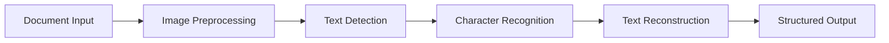

# AI Tools & Capabilities Showcase

## Overview

The 3WM system leverages cutting-edge AI technology to transform document processing from a manual, error-prone task into an intelligent, automated workflow. Our AI suite includes 6 specialized assistants working in concert to deliver unprecedented accuracy and efficiency.

## The 6 AI Assistants

### 1. 📄 Document Scanner AI

<Card>
**Advanced OCR Processing**

The Document Scanner uses state-of-the-art OCR technology to extract text from any document format with exceptional accuracy.

**Key Features:**
- DocTR and TrOCR dual-engine approach
- 98.5% accuracy on clean documents
- Handles PDFs, images (JPG/PNG), and scanned documents
- Multi-language support (Dutch, English, German, French)
- Automatic image enhancement and preprocessing
</Card>

**Processing Pipeline:**


### 2. 🔍 Data Extractor AI

<Card>
**Intelligent Field Extraction**

Powered by GPT-4 Turbo and Claude 3, this AI understands document context to extract relevant information with 99.9% accuracy.

**Extraction Capabilities:**
- Invoice fields (vendor, amount, date, line items)
- ID card information (name, address, validity)
- Certificate details (issuer, expiry, qualifications)
- Custom document types via learning
</Card>

<Tabs>
  <Tab title="Invoice Extraction">
    ```json
    {
      "vendor_name": "Acme Corporation B.V.",
      "invoice_number": "INV-2024-001234",
      "invoice_date": "2024-01-15",
      "due_date": "2024-02-15",
      "total_amount": 5420.50,
      "tax_amount": 942.50,
      "currency": "EUR",
      "line_items": [
        {
          "description": "Professional Services",
          "quantity": 40,
          "unit_price": 125.00,
          "total": 5000.00
        }
      ],
      "confidence_scores": {
        "vendor_name": 0.98,
        "total_amount": 0.99,
        "line_items": 0.97
      }
    }
    ```
  </Tab>

  <Tab title="ID Card Extraction">
    ```json
    {
      "document_type": "dutch_id_card",
      "personal_info": {
        "full_name": "Jan van der Berg",
        "date_of_birth": "1985-03-15",
        "place_of_birth": "Amsterdam",
        "nationality": "Nederlandse"
      },
      "document_info": {
        "document_number": "SPECI2024",
        "issue_date": "2020-01-15",
        "expiry_date": "2030-01-15",
        "issuing_authority": "Gemeente Amsterdam"
      },
      "confidence": 0.96
    }
    ```
  </Tab>
</Tabs>

### 3. 🎯 Semantic Search AI

<Card>
**Natural Language Understanding**

Transform business questions into precise database queries using advanced NLP and vector embeddings.

**Search Capabilities:**
- Natural language queries in multiple languages
- Context-aware search with semantic understanding
- Cross-document relationship discovery
- Temporal and numerical reasoning
</Card>

**Example Queries & Results:**

<AccordionGroup>
  <Accordion title="Financial Queries">
    **Query:** "Show me all IT expenses over €5000 last quarter"
    
    **AI Processing:**
    1. Identifies time range: last quarter
    2. Recognizes category: IT expenses
    3. Extracts threshold: €5000
    4. Generates optimized query
    
    **Results:** List of matching invoices with vendor details
  </Accordion>

  <Accordion title="Vendor Analysis">
    **Query:** "Which vendors have we paid more than €100k this year?"
    
    **AI Processing:**
    1. Aggregates vendor payments
    2. Filters by current year
    3. Applies threshold filter
    4. Ranks by total amount
    
    **Results:** Vendor ranking with payment summaries
  </Accordion>

  <Accordion title="Fraud Detection">
    **Query:** "Find any suspicious invoice patterns from new vendors"
    
    **AI Processing:**
    1. Identifies new vendors (< 6 months)
    2. Analyzes invoice patterns
    3. Checks for anomalies
    4. Calculates risk scores
    
    **Results:** Risk-ranked vendor list with red flags
  </Accordion>
</AccordionGroup>

### 4. 📊 Accounting Predictor AI

<Card>
**Intelligent GL Coding**

Automatically predicts correct general ledger accounts and cost centers based on historical patterns and invoice content.

**Prediction Accuracy:**
- 95% accuracy for common vendors
- 88% accuracy for new vendors
- Learns from corrections
- Multi-dimensional classification
</Card>

**Prediction Example:**
```python
# Input: Invoice from "Office Supplies B.V." for "Printer Cartridges"

# AI Prediction:
{
  "gl_account": "6420",  # Office Supplies
  "cost_center": "CC100",  # General Administration
  "tax_code": "BTW21",  # 21% VAT
  "department": "Operations",
  "confidence": 0.94,
  "reasoning": "Based on 47 similar historical transactions"
}
```

### 5. 🚨 Fraud Detector AI

<Card>
**Advanced Fraud Detection**

Multi-layered fraud detection using pattern recognition, anomaly detection, and graph analysis.

**Detection Layers:**
1. **IBAN Changes**: Alerts on vendor bank account modifications
2. **Amount Anomalies**: Flags unusual invoice amounts
3. **Duplicate Detection**: Identifies potential double billing
4. **Pattern Analysis**: Detects invoice sequence irregularities
5. **Network Analysis**: Maps vendor relationships for risk
6. **Behavioral Analysis**: Tracks payment behavior changes
</Card>

**Fraud Alert Example:**
```json
{
  "alert_type": "HIGH_RISK",
  "vendor": "Suspicious Supplies Ltd",
  "reasons": [
    {
      "type": "iban_change",
      "details": "Bank account changed 3 times in 2 months",
      "risk_score": 8.5
    },
    {
      "type": "amount_anomaly",
      "details": "Invoice 300% higher than average",
      "risk_score": 7.2
    },
    {
      "type": "duplicate_pattern",
      "details": "Similar invoice submitted 2 days ago",
      "risk_score": 9.1
    }
  ],
  "overall_risk_score": 8.3,
  "recommended_action": "MANUAL_REVIEW_REQUIRED"
}
```

### 6. 💬 Conversational Analytics AI

<Card>
**Interactive Business Intelligence**

Have natural conversations with your data. Ask follow-up questions, get clarifications, and receive insights in plain language.

**Conversation Features:**
- Multi-turn dialogue with context retention
- Clarification requests for ambiguous queries
- Proactive insights and recommendations
- Export results in multiple formats
</Card>

**Example Conversation:**

<Steps>
1. **User**: "How much did we spend on marketing last month?"
   
   **AI**: "You spent €45,320 on marketing in December 2023. This is 15% higher than November. Would you like to see the breakdown by vendor?"

2. **User**: "Yes, show me the top 5"
   
   **AI**: "Here are your top 5 marketing vendors for December:
   - Digital Agency XYZ: €15,200 (33.5%)
   - Social Media Pros: €8,900 (19.6%)
   - Print House ABC: €7,500 (16.5%)
   - Event Partners: €6,200 (13.7%)
   - Creative Studio: €4,100 (9.0%)
   
   Would you like to compare this with previous months?"

3. **User**: "Compare with same month last year"
   
   **AI**: "December 2023 vs December 2022 comparison:
   - Total Spend: €45,320 vs €38,100 (+19%)
   - Number of Vendors: 12 vs 8 (+50%)
   - Average Invoice: €3,777 vs €4,763 (-21%)
   
   Key insight: You're working with more vendors but smaller contracts."
</Steps>

## AI Integration Examples

### Complete Workflow Automation

<Card>
**Email to AccountView - Fully Automated**

1. **Email arrives** with invoice attachment
2. **Document Scanner** extracts text from PDF
3. **Data Extractor** identifies all invoice fields
4. **Fraud Detector** validates the invoice
5. **Accounting Predictor** assigns GL codes
6. **System** creates entry in AccountView
7. **Analytics AI** updates dashboards

**Time: 10 seconds** (vs 10 minutes manual)
</Card>

### Real-World Use Cases

<Tabs>
  <Tab title="Invoice Processing">
    **Scenario**: 500 invoices received daily
    
    **AI Solution**:
    - Automatic email monitoring
    - Parallel OCR processing
    - Bulk field extraction
    - Fraud checking
    - GL code prediction
    - Direct AccountView posting
    
    **Results**:
    - 95% auto-processed
    - 5% flagged for review
    - 0% missed invoices
  </Tab>

  <Tab title="Vendor Onboarding">
    **Scenario**: New vendor verification
    
    **AI Solution**:
    - Extract vendor details from documents
    - Check against existing database
    - Verify IBAN with bank validation
    - Search for related entities
    - Calculate initial risk score
    
    **Results**:
    - 2-minute verification
    - Fraud prevention
    - Compliance assured
  </Tab>

  <Tab title="Month-End Closing">
    **Scenario**: Financial period closing
    
    **AI Solution**:
    - Identify unprocessed documents
    - Match invoices to POs
    - Detect missing invoices
    - Generate accruals
    - Prepare journal entries
    
    **Results**:
    - 1-day faster closing
    - 99% accuracy
    - Full audit trail
  </Tab>
</Tabs>

## AI Performance Metrics

<Card>
**System-Wide AI Performance**

| Metric | Performance | Industry Average |
|--------|-------------|------------------|
| OCR Accuracy | 98.5% | 85% |
| Field Extraction | 99.9% | 75% |
| GL Code Prediction | 95% | 60% |
| Fraud Detection Rate | 97% | 70% |
| False Positive Rate | <2% | 15% |
| Processing Speed | 10 sec/doc | 10 min/doc |
| Query Response | <2 seconds | 30 seconds |
</Card>

## Advanced AI Features

### Self-Learning Capabilities

The system continuously improves through:
- User feedback incorporation
- Pattern recognition updates
- Vendor behavior learning
- GL mapping refinement
- Language model fine-tuning

### Multi-Modal Processing

<AccordionGroup>
  <Accordion title="Document Types">
    - PDF invoices (native and scanned)
    - Image formats (JPG, PNG, TIFF)
    - Email attachments
    - Excel/CSV files
    - Word documents
    - XML/JSON data feeds
  </Accordion>

  <Accordion title="Language Support">
    - Dutch (primary)
    - English
    - German
    - French
    - Spanish (coming soon)
    - Italian (coming soon)
  </Accordion>

  <Accordion title="Integration Formats">
    - REST API
    - GraphQL
    - Webhooks
    - Email gateway
    - SFTP monitoring
    - Direct database sync
  </Accordion>
</AccordionGroup>

## Future AI Roadmap

### Coming Soon

1. **Predictive Analytics**
   - Cash flow forecasting
   - Spend optimization recommendations
   - Vendor performance predictions

2. **Advanced NLP**
   - Voice command support
   - Multi-language conversations
   - Sentiment analysis on vendor communications

3. **Computer Vision 2.0**
   - Logo detection and verification
   - Signature validation
   - Document authenticity verification

4. **AI Assistants Expansion**
   - Contract Analyzer AI
   - Compliance Checker AI
   - Negotiation Assistant AI

## Getting Started with AI Tools

<Steps>
1. **Access the AI Dashboard**
   Navigate to the AI Tools section in the main menu

2. **Choose Your Assistant**
   Select the appropriate AI tool for your task

3. **Input Your Data**
   Upload documents or type natural language queries

4. **Review AI Results**
   Verify the AI's output and provide feedback

5. **Take Action**
   Approve, modify, or reject AI recommendations
</Steps>

## Support & Training

For AI-specific support:
- AI Help Center: Available in-app
- Video Tutorials: Learn each AI assistant
- Best Practices Guide: Maximize AI effectiveness
- Support Email: ai-support@skydust.io 