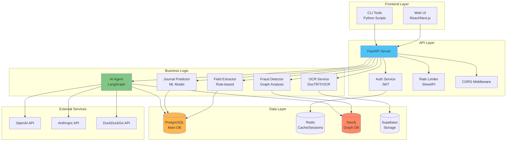

## Architectuur Overzicht

Het 3WM systeem is gebouwd volgens een gelaagde microservices architectuur met duidelijke scheiding tussen presentatie, business logic, en data layers.



## Layer Beschrijvingen

### Frontend Layer

<CardGroup cols={2}>
  <Card title="Web UI" icon="browser">
    **Tech Stack**: React/Next.js
    - Modern responsive interface
    - Real-time updates via WebSocket
    - Progressive Web App capabilities
    - Accessibility-first design
  </Card>
  
  <Card title="CLI Tools" icon="terminal">
    **Tech Stack**: Python Click
    - `manage_documents.py` voor batch processing
    - `test_api.py` voor system testing
    - Cron-compatible voor automatisering
  </Card>
</CardGroup>

### API Layer

De API layer handelt alle client requests af en zorgt voor security, rate limiting, en routing.

<Tabs>
  <Tab title="FastAPI Server">
    ```python
    # Core API endpoints
    /api/upload          # Document upload
    /api/process         # Document processing
    /api/agent/query     # AI agent queries
    /api/journal/predict # Journal prediction
    /api/auth/*          # Authentication
    ```
  </Tab>
  
  <Tab title="Middleware Stack">
    1. **CORS Middleware**: Cross-origin resource sharing
    2. **Rate Limiter**: 30 requests/minute per IP
    3. **Auth Middleware**: JWT token validation
    4. **Logging Middleware**: Request/response logging
  </Tab>
</Tabs>

### Business Logic Layer

De kern van het systeem - waar alle intelligentie zit:

#### AI Agent (LangGraph)
- **Functie**: Natuurlijke taal interface
- **Tools**: 15+ gespecialiseerde tools
- **Models**: GPT-4 Turbo, Claude 3
- **Features**: Streaming, multi-tool execution

#### OCR Service
- **Primary**: DocTR voor moderne documenten
- **Fallback**: TrOCR voor complexe layouts
- **Output**: Structured text met confidence scores

#### Field Extractor
- **Method**: Rule-based + ML hybrid
- **Fields**: 20+ standaard velden
- **Validation**: Real-time verificatie

#### Journal Predictor
- **Algorithm**: Similarity-based ML
- **Accuracy**: 95%+ voor bekende patronen
- **Output**: AccountView-compatibele journaalposten

#### Fraud Detector
- **Engine**: Neo4j graph analysis
- **Signals**: 6 fraud indicatoren
- **Real-time**: < 100ms response time

### Data Layer

<Info>
Het systeem gebruikt een polyglot persistence strategie - elke database is geoptimaliseerd voor zijn specifieke use case.
</Info>

#### PostgreSQL
- **Use Case**: Transactionele data, gebruikers
- **Schema**: 15+ tables
- **Features**: JSONB voor flexibiliteit

#### Redis
- **Use Case**: Sessions, caching, queues
- **TTL**: 24 uur voor sessions
- **Performance**: < 1ms latency

#### Neo4j
- **Use Case**: Relatie analyse, fraud detectie
- **Nodes**: Vendors, Invoices, Accounts
- **Relationships**: SUPPLIED, POSTED_TO, SIMILAR_TO

#### Supabase
- **Use Case**: Document storage, vector search
- **Storage**: S3-compatible object storage
- **Vectors**: PGVector voor embeddings

### External Services

Het systeem integreert met verschillende externe AI services:

<CardGroup cols={3}>
  <Card title="OpenAI" icon="robot">
    - GPT-4 Turbo voor reasoning
    - text-embedding-3-small voor vectors
    - Fallback naar GPT-3.5
  </Card>
  
  <Card title="Anthropic" icon="brain">
    - Claude 3 voor complexe taken
    - Beter voor Nederlandse tekst
    - Gebruikt voor validatie
  </Card>
  
  <Card title="Search APIs" icon="search">
    - DuckDuckGo voor web search
    - Tavily voor AI-optimized search
    - KVK API voor bedrijfsdata
  </Card>
</CardGroup>

## Deployment Architecture

### Container Structure
```yaml
services:
  api:
    image: 3wm-api:latest
    replicas: 3
    
  postgres:
    image: postgres:15
    volumes: pgdata
    
  redis:
    image: redis:7-alpine
    
  neo4j:
    image: neo4j:5
    volumes: neo4j-data
```

### Scaling Strategy
- **Horizontal**: API servers (3+ replicas)
- **Vertical**: Database servers (CPU/RAM)
- **Queue-based**: Batch processing
- **Caching**: Redis voor hot data

## Security Architecture

<Warning>
Alle communicatie gebruikt TLS 1.3 en JWT tokens hebben een maximale levensduur van 24 uur.
</Warning>

### Security Layers
1. **Network**: VPC isolation, firewall rules
2. **Application**: JWT auth, RBAC
3. **Data**: Encryption at rest, field-level encryption
4. **Audit**: Comprehensive logging, tamper-proof audit trail 