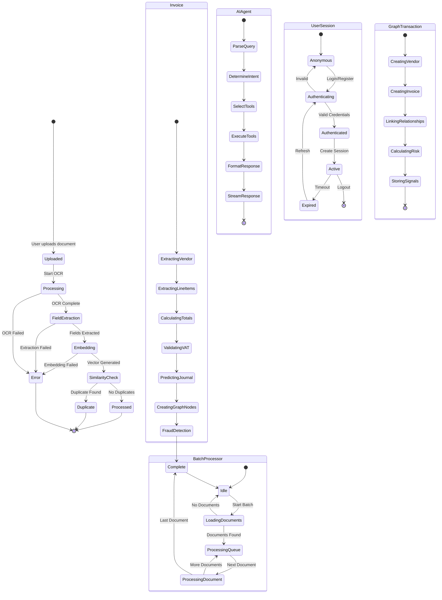

## State Management Overview

Het 3WM systeem gebruikt state machines voor het beheren van complexe workflows en het garanderen van data consistentie.



## Document Lifecycle

### Status Overzicht
- **Uploaded**: Document ontvangen en opgeslagen
- **Processing**: OCR verwerking actief
- **FieldExtraction**: Data extractie bezig
- **Embedding**: Vector generatie
- **SimilarityCheck**: Duplicate detectie
- **Processed**: Succesvol verwerkt
- **Duplicate**: Duplicaat gedetecteerd
- **Error**: Verwerking mislukt

### State Transitions
Elk document doorloopt een voorspelbare lifecycle:

<Steps>
  <Step title="Upload">
    Document wordt geüpload en krijgt INS naam
  </Step>
  <Step title="OCR Processing">
    Text extractie met DocTR/TrOCR
  </Step>
  <Step title="Field Extraction">
    Intelligente data extractie
  </Step>
  <Step title="Embedding Generation">
    384-dimensionale vector creatie
  </Step>
  <Step title="Similarity Check">
    Vergelijking met bestaande documenten
  </Step>
  <Step title="Final Status">
    Processed, Duplicate, of Error
  </Step>
</Steps>

## Invoice Processing States

Facturen hebben een uitgebreide state machine voor gedetailleerde verwerking:

<Card title="Invoice States" icon="file-invoice">
  1. **ExtractingVendor**: Leverancier identificatie
  2. **ExtractingLineItems**: Factuurregels detectie
  3. **CalculatingTotals**: Bedragen verificatie
  4. **ValidatingVAT**: BTW controle
  5. **PredictingJournal**: Journaalpost voorspelling
  6. **CreatingGraphNodes**: Neo4j update
  7. **FraudDetection**: Risico analyse
  8. **Complete**: Verwerking voltooid
</Card>

## AI Agent States

De LangGraph agent heeft zijn eigen state machine voor query verwerking:

### Query Processing Flow
- **ParseQuery**: Natuurlijke taal analyse
- **DetermineIntent**: Intent classificatie
- **SelectTools**: Tool selectie op basis van intent
- **ExecuteTools**: Parallel tool execution
- **FormatResponse**: Response structurering
- **StreamResponse**: Real-time streaming naar client

## Session Management

### User Session States
```
Anonymous → Authenticating → Authenticated → Active → Expired
                    ↓                                      ↓
                Anonymous ← ← ← ← ← ← ← ← ← ← ← ← Logout
```

### Session Properties
- **Timeout**: 24 uur inactiviteit
- **Refresh**: Automatisch bij API calls
- **Storage**: Redis met TTL

## Batch Processing States

De batch processor voor nachtelijke verwerking:

<Info>
Batch processing draait elke nacht om 2:00 AM en verwerkt alle pending documenten.
</Info>

### Batch States
- **Idle**: Wacht op trigger
- **LoadingDocuments**: Laadt pending documenten
- **ProcessingQueue**: Verwerkt documenten sequentieel
- **ProcessingDocument**: Actieve document verwerking
- **Complete**: Batch voltooid

## Neo4j Transaction States

Graph database transacties voor consistentie:

### Transaction Flow
1. **CreatingVendor**: Vendor node aanmaken/updaten
2. **CreatingInvoice**: Invoice node creëren
3. **LinkingRelationships**: SUPPLIED, POSTED_TO relaties
4. **CalculatingRisk**: Risk score berekening
5. **StoringSignals**: Fraud signals opslaan

<Warning>
Alle Neo4j operaties zijn transactioneel - bij failure wordt de complete transactie teruggedraaid.
</Warning> 