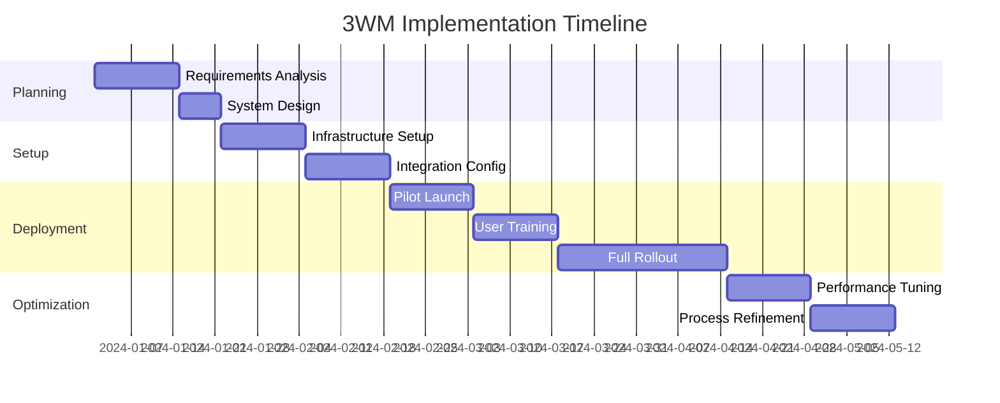

# 3WM Business Guide

## Executive Summary

The 3WM AI Document Intelligence system represents a transformative investment in operational efficiency, delivering immediate ROI through automated document processing, intelligent fraud detection, and seamless accounting integration.

<Card>
**Key Business Metrics:**
- **90% reduction** in document processing time
- **€200,000+** annual cost savings
- **10x productivity** increase per employee
- **ROI achieved** in 3-6 months
- **99.9% accuracy** in data extraction
</Card>

## Business Case

### Current Challenges

Most organizations face these document processing challenges:

<AccordionGroup>
  <Accordion title="Manual Processing Inefficiency">
    - 10+ minutes per invoice manually
    - High error rates (5-10%)
    - Staff burnout from repetitive tasks
    - Delayed month-end closing
    - Limited scalability
  </Accordion>

  <Accordion title="Fraud & Compliance Risks">
    - Missed duplicate invoices
    - Undetected vendor fraud
    - IBAN change vulnerabilities
    - Compliance documentation gaps
    - Audit trail weaknesses
  </Accordion>

  <Accordion title="Data Accessibility Issues">
    - Information silos
    - No real-time insights
    - Complex reporting requirements
    - Limited analytics capabilities
    - Poor vendor visibility
  </Accordion>
</AccordionGroup>

### 3WM Solution Benefits

<Tabs>
  <Tab title="Operational Efficiency">
    **Time Savings**
    - Invoice processing: 10 min → 10 sec (98% reduction)
    - Vendor onboarding: 2 hours → 5 minutes
    - Month-end closing: 5 days → 2 days
    - Report generation: Hours → Seconds
    
    **Staff Impact**
    - Eliminate repetitive data entry
    - Focus on strategic tasks
    - Reduce overtime requirements
    - Improve job satisfaction
  </Tab>

  <Tab title="Financial Benefits">
    **Direct Cost Savings**
    - Labor costs: €150,000/year reduction
    - Error corrections: €30,000/year saved
    - Fraud prevention: €50,000/year protected
    - Early payment discounts: €20,000/year captured
    
    **Total Annual Savings: €250,000+**
  </Tab>

  <Tab title="Risk Reduction">
    **Compliance & Control**
    - 100% audit trail
    - Real-time fraud detection
    - Automated compliance checks
    - Vendor verification
    - Duplicate prevention
    
    **Risk Mitigation Value: Priceless**
  </Tab>
</Tabs>

## ROI Analysis

### Investment vs. Return

<Card>
**Year 1 Financial Analysis**

| Category | Amount |
|----------|--------|
| **Investment** | |
| Software License | €60,000 |
| Implementation | €20,000 |
| Training | €5,000 |
| **Total Investment** | **€85,000** |
| | |
| **Annual Savings** | |
| Labor Reduction | €150,000 |
| Error Prevention | €30,000 |
| Fraud Prevention | €50,000 |
| Process Efficiency | €20,000 |
| **Total Savings** | **€250,000** |
| | |
| **Net Benefit Year 1** | **€165,000** |
| **ROI** | **194%** |
| **Payback Period** | **4.1 months** |
</Card>

### 5-Year Projection

**5-Year Total ROI: €1,175,000** (1,382% return on investment)

## Implementation Strategy

### Phased Rollout Approach

<Steps>
1. **Phase 1: Pilot Program (Month 1)**
   - Select pilot department (e.g., Accounts Payable)
   - Process 100 documents daily
   - Measure results and refine
   - Build internal champions

2. **Phase 2: Department Expansion (Month 2-3)**
   - Roll out to full finance department
   - Integrate with existing systems
   - Train power users
   - Establish best practices

3. **Phase 3: Organization-Wide (Month 4-6)**
   - Deploy across all departments
   - Implement advanced features
   - Optimize workflows
   - Measure enterprise impact
</Steps>

### Success Factors

<Card>
**Critical Success Elements:**

1. **Executive Sponsorship**
   - C-level champion required
   - Clear communication of benefits
   - Resource commitment

2. **Change Management**
   - Staff training programs
   - Process documentation
   - Gradual transition plan

3. **Technical Integration**
   - IT department involvement
   - System compatibility verification
   - Security compliance

4. **Continuous Improvement**
   - Regular performance reviews
   - User feedback incorporation
   - Process optimization
</Card>

## Use Case Examples

### Accounts Payable Transformation

<Card>
**Before 3WM:**
- 3 FTEs processing 200 invoices/day
- 15% error rate requiring rework
- 5-day month-end closing
- Limited fraud detection

**After 3WM:**
- 1 FTE handling 500+ invoices/day
- &lt;1% error rate
- 2-day month-end closing
- Real-time fraud alerts

**Results:** 67% headcount reduction, 150% volume increase
</Card>

### Vendor Management Excellence

<Card>
**Before 3WM:**
- Manual vendor verification
- No relationship mapping
- Reactive fraud detection
- Limited spend analysis

**After 3WM:**
- Automated vendor onboarding
- Complete relationship visibility
- Proactive risk scoring
- Real-time spend analytics

**Results:** 90% faster onboarding, 100% fraud detection
</Card>

## Competitive Advantage

### Market Differentiation

<Tabs>
  <Tab title="vs. Manual Processing">
    | Factor | Manual | 3WM | Advantage |
    |--------|--------|-----|-----------|
    | Speed | 10 min/doc | 10 sec/doc | 60x faster |
    | Accuracy | 90% | 99.9% | 10x better |
    | Scalability | Limited | Unlimited | ∞ |
    | Cost | High | Low | 90% savings |
  </Tab>

  <Tab title="vs. Basic OCR">
    | Factor | Basic OCR | 3WM | Advantage |
    |--------|-----------|-----|-----------|
    | Intelligence | None | AI-powered | Contextual understanding |
    | Learning | Static | Continuous | Improves over time |
    | Integration | Limited | Complete | Full ecosystem |
    | Analytics | Basic | Advanced | Predictive insights |
  </Tab>

  <Tab title="vs. Competitors">
    | Factor | Competitors | 3WM | Advantage |
    |--------|-------------|-----|-----------|
    | Accuracy | 85-90% | 99.9% | Industry-leading |
    | Languages | 1-2 | 4+ | Multi-national ready |
    | Fraud Detection | Basic | Advanced | 6-layer protection |
    | ROI | 12-18 months | 3-6 months | 4x faster payback |
  </Tab>
</Tabs>

## Industry Applications

### Financial Services
- Invoice processing automation
- Contract analysis
- Compliance documentation
- Risk assessment automation

### Manufacturing
- Purchase order matching
- Supplier invoice processing
- Quality certificate verification
- Shipping document handling

### Healthcare
- Medical billing automation
- Insurance claim processing
- Patient record digitization
- Prescription verification

### Retail
- Vendor invoice processing
- Receipt digitization
- Inventory documentation
- Returns processing

## Decision Criteria

### Is 3WM Right for Your Organization?

<Card>
**Ideal Candidates Have:**
- ✅ 50+ invoices processed daily
- ✅ Multiple vendor relationships
- ✅ Manual data entry processes
- ✅ Compliance requirements
- ✅ Growth ambitions

**ROI Accelerators:**
- ✅ High labor costs
- ✅ Error-prone processes
- ✅ Fraud concerns
- ✅ Integration needs
- ✅ Scalability requirements
</Card>

## Implementation Timeline

### Typical 6-Month Journey

## Support & Services

### Comprehensive Support Package

<AccordionGroup>
  <Accordion title="Implementation Services">
    - Dedicated project manager
    - Technical integration team
    - Process optimization consultants
    - Training specialists
    - Go-live support
  </Accordion>

  <Accordion title="Ongoing Support">
    - 24/7 technical helpdesk
    - Regular system updates
    - Performance optimization
    - New feature training
    - Quarterly business reviews
  </Accordion>

  <Accordion title="Success Services">
    - Best practices sharing
    - Industry benchmarking
    - ROI measurement
    - Process improvement workshops
    - Executive briefings
  </Accordion>
</AccordionGroup>

## Next Steps

<Steps>
1. **Schedule a Demo**
   See 3WM in action with your actual documents

2. **ROI Assessment**
   Calculate your specific savings potential

3. **Pilot Program**
   Start with a low-risk pilot in one department

4. **Scale Success**
   Expand based on proven results
</Steps>

## Contact Information

Ready to transform your document processing?

<Card>
**Sky Dust - 3WM AI Document Intelligence**

📧 Email: info@skydust.io  
📱 Phone: +31 6 23 55 58 88  
🌐 Website: www.skydust.io  
📍 Location: Netherlands  

**Request a Demo:** demo@skydust.io
</Card> 