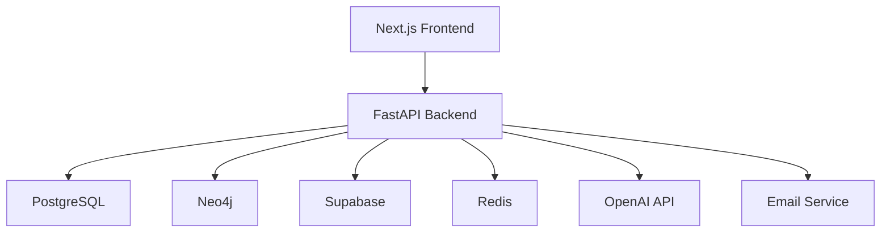

# 3WM Developer Guide

## Getting Started

### Prerequisites

<Card>
**Required Software:**
- Python 3.11+
- Node.js 18+
- Docker & Docker Compose
- PostgreSQL 15+
- Neo4j 5.0+
- Redis 7.0+
</Card>

### Quick Start

<Steps>
1. **Clone the repository**
   ```bash
   git clone https://github.com/skydust/3wm-system.git
   cd 3wm-system
   ```

2. **Set up environment variables**
   ```bash
   cp .env.example .env
   # Edit .env with your configuration
   ```

3. **Start with Docker Compose**
   ```bash
   docker-compose up -d
   ```

4. **Access the application**
   - Frontend: http://localhost:3000
   - Backend API: http://localhost:8000
   - API Docs: http://localhost:8000/docs
</Steps>

## Architecture Overview

### System Components



### Directory Structure

<Tabs>
  <Tab title="Backend">
    ```
    3WM-good/
    ├── app/
    │   ├── api/           # API endpoints
    │   ├── core/          # Core utilities
    │   ├── models/        # Data models
    │   ├── services/      # Business logic
    │   ├── agent/         # AI agents
    │   ├── ocr/           # OCR processing
    │   └── graph/         # Neo4j operations
    ├── scripts/           # Utility scripts
    ├── tests/             # Test suite
    └── docker/            # Docker configs
    ```
  </Tab>

  <Tab title="Frontend">
    ```
    client/
    ├── src/
    │   ├── app/           # Next.js pages
    │   ├── components/    # React components
    │   ├── lib/           # Utilities
    │   ├── types/         # TypeScript types
    │   └── utils/         # Helper functions
    ├── public/            # Static assets
    └── tests/             # Frontend tests
    ```
  </Tab>
</Tabs>

## API Development

### Authentication

All API endpoints require JWT authentication:

<CodeGroup>
```python Backend Implementation
from fastapi import Depends, HTTPException
from app.core.security import verify_token

async def get_current_user(token: str = Depends(verify_token)):
    if not token:
        raise HTTPException(status_code=401)
    return token.user
```

```typescript Frontend Usage
const response = await fetch('/api/v1/documents', {
  headers: {
    'Authorization': `Bearer ${token}`,
    'Content-Type': 'application/json'
  }
});
```
</CodeGroup>

### Creating New Endpoints

<Steps>
1. **Define the route in `app/api/`**
   ```python
   from fastapi import APIRouter, Depends
   from app.models.schemas import DocumentResponse
   
   router = APIRouter()
   
   @router.get("/documents/{doc_id}", response_model=DocumentResponse)
   async def get_document(doc_id: str, user=Depends(get_current_user)):
       # Implementation
       pass
   ```

2. **Add business logic in `app/services/`**
   ```python
   class DocumentService:
       async def get_document(self, doc_id: str, user_id: str):
           # Business logic here
           return document
   ```

3. **Register in main app**
   ```python
   from app.api import documents
   
   app.include_router(documents.router, prefix="/api/v1")
   ```
</Steps>

### Database Operations

<Tabs>
  <Tab title="PostgreSQL">
    ```python
    from app.services.database import get_db
    from sqlmodel import select
    
    async def get_user_documents(user_id: str):
        async with get_db() as session:
            statement = select(Document).where(
                Document.user_id == user_id
            )
            results = await session.exec(statement)
            return results.all()
    ```
  </Tab>

  <Tab title="Neo4j">
    ```python
    from app.graph.client import neo4j_client
    
    async def get_vendor_network(vendor_name: str):
        query = """
        MATCH (v:Vendor {name: $vendor_name})-[r]->(related)
        RETURN v, r, related
        LIMIT 50
        """
        return await neo4j_client.execute(
            query, 
            {"vendor_name": vendor_name}
        )
    ```
  </Tab>

  <Tab title="Supabase">
    ```python
    from app.services.supabase import supabase_client
    
    async def search_similar_invoices(embedding: list[float]):
        response = supabase_client.rpc(
            'match_invoices',
            {
                'query_embedding': embedding,
                'match_threshold': 0.8,
                'match_count': 10
            }
        ).execute()
        return response.data
    ```
  </Tab>
</Tabs>

## AI Agent Development

### Creating Custom Tools

```python
from langchain.tools import tool
from app.services.database import DocumentService

@tool
def search_documents(query: str) -> str:
    """Search documents by natural language query."""
    service = DocumentService()
    results = service.search(query)
    return format_results(results)

# Register tool with agent
tools = [search_documents, analyze_vendor, check_fraud]
```

### Agent Implementation

```python
from langgraph.graph import StateGraph
from app.agent.state import AgentState

# Define the graph
workflow = StateGraph(AgentState)

# Add nodes
workflow.add_node("analyze", analyze_query)
workflow.add_node("search", search_documents)
workflow.add_node("format", format_response)

# Add edges
workflow.add_edge("analyze", "search")
workflow.add_edge("search", "format")

# Compile
app = workflow.compile()
```

## Frontend Development

### Component Structure

<CodeGroup>
```typescript Invoice Component
interface InvoiceCardProps {
  invoice: Invoice;
  onApprove: (id: string) => void;
  onReject: (id: string) => void;
}

export function InvoiceCard({ 
  invoice, 
  onApprove, 
  onReject 
}: InvoiceCardProps) {
  return (
    <Card>
      <CardHeader>
        <h3>{invoice.vendor_name}</h3>
        <Badge>{invoice.status}</Badge>
      </CardHeader>
      <CardContent>
        <p>Amount: {invoice.formatted_amount}</p>
        <p>Date: {invoice.date}</p>
      </CardContent>
      <CardFooter>
        <Button onClick={() => onApprove(invoice.id)}>
          Approve
        </Button>
        <Button variant="outline" onClick={() => onReject(invoice.id)}>
          Reject
        </Button>
      </CardFooter>
    </Card>
  );
}
```

```typescript API Hook
import { useQuery } from '@tanstack/react-query';

export function useInvoices() {
  return useQuery({
    queryKey: ['invoices'],
    queryFn: async () => {
      const response = await fetch('/api/v1/invoices', {
        headers: {
          'Authorization': `Bearer ${getToken()}`
        }
      });
      return response.json();
    }
  });
}
```
</CodeGroup>

### State Management

```typescript
// Using React Context for global state
interface AppState {
  user: User | null;
  theme: 'light' | 'dark';
  notifications: Notification[];
}

const AppContext = createContext<AppState | null>(null);

export function AppProvider({ children }: { children: ReactNode }) {
  const [state, setState] = useState<AppState>({
    user: null,
    theme: 'light',
    notifications: []
  });

  return (
    <AppContext.Provider value={state}>
      {children}
    </AppContext.Provider>
  );
}
```

## Testing

### Backend Testing

```python
import pytest
from httpx import AsyncClient
from app.main import app

@pytest.mark.asyncio
async def test_upload_document():
    async with AsyncClient(app=app, base_url="http://test") as client:
        # Login first
        login_response = await client.post("/api/v1/auth/login", json={
            "email": "test@example.com",
            "password": "testpass"
        })
        token = login_response.json()["access_token"]
        
        # Upload document
        files = {"file": ("test.pdf", b"PDF content", "application/pdf")}
        response = await client.post(
            "/api/v1/upload/",
            files=files,
            headers={"Authorization": f"Bearer {token}"}
        )
        
        assert response.status_code == 200
        assert "document_id" in response.json()
```

### Frontend Testing

```typescript
import { render, screen, fireEvent } from '@testing-library/react';
import { InvoiceCard } from '@/components/invoice-card';

describe('InvoiceCard', () => {
  it('renders invoice details', () => {
    const invoice = {
      id: '1',
      vendor_name: 'Acme Corp',
      amount: 1000,
      formatted_amount: '€1,000.00',
      date: '2024-01-01',
      status: 'pending'
    };

    render(
      <InvoiceCard 
        invoice={invoice}
        onApprove={jest.fn()}
        onReject={jest.fn()}
      />
    );

    expect(screen.getByText('Acme Corp')).toBeInTheDocument();
    expect(screen.getByText('€1,000.00')).toBeInTheDocument();
  });
});
```

## Deployment

### Docker Production Build

```dockerfile
# Backend Dockerfile
FROM python:3.11-slim

WORKDIR /app
COPY requirements.txt .
RUN pip install -r requirements.txt

COPY . .
CMD ["uvicorn", "app.main:app", "--host", "0.0.0.0", "--port", "8000"]
```

### Environment Configuration

```bash
# Production .env
DATABASE_URL=postgresql://user:pass@db:5432/3wm
NEO4J_URI=bolt://neo4j:7687
SUPABASE_URL=https://your-project.supabase.co
OPENAI_API_KEY=sk-...
JWT_SECRET=your-secret-key
REDIS_URL=redis://redis:6379
```

### Monitoring Setup

```yaml
# Prometheus configuration
global:
  scrape_interval: 15s

scrape_configs:
  - job_name: '3wm-backend'
    static_configs:
      - targets: ['backend:8000']
    metrics_path: '/metrics'
```

## Performance Optimization

### Backend Optimization

<AccordionGroup>
  <Accordion title="Database Queries">
    ```python
    # Use eager loading to prevent N+1 queries
    statement = select(Invoice).options(
        selectinload(Invoice.line_items),
        selectinload(Invoice.vendor)
    )
    ```
  </Accordion>

  <Accordion title="Caching">
    ```python
    from app.core.cache import cache
    
    @cache(expire=3600)
    async def get_vendor_stats(vendor_id: str):
        # Expensive calculation
        return stats
    ```
  </Accordion>

  <Accordion title="Async Processing">
    ```python
    from app.core.celery import celery_app
    
    @celery_app.task
    def process_document_async(document_id: str):
        # Long-running task
        pass
    ```
  </Accordion>
</AccordionGroup>

### Frontend Optimization

- Implement code splitting with dynamic imports
- Use React.memo for expensive components
- Optimize images with Next.js Image component
- Enable ISR (Incremental Static Regeneration)
- Implement virtual scrolling for large lists

## Security Best Practices

1. **Input Validation**: Always validate user input
2. **SQL Injection**: Use parameterized queries
3. **XSS Prevention**: Sanitize user content
4. **CORS**: Configure allowed origins
5. **Rate Limiting**: Implement per-user limits
6. **Secrets Management**: Use environment variables
7. **HTTPS**: Always use TLS in production

## Troubleshooting

### Common Issues

<Tabs>
  <Tab title="Connection Errors">
    ```bash
    # Check service status
    docker-compose ps
    
    # View logs
    docker-compose logs backend
    
    # Test database connection
    docker-compose exec backend python -c "from app.services.database import test_connection; test_connection()"
    ```
  </Tab>

  <Tab title="Authentication Issues">
    ```python
    # Debug JWT tokens
    import jwt
    
    token = "your.jwt.token"
    decoded = jwt.decode(token, options={"verify_signature": False})
    print(decoded)
    ```
  </Tab>

  <Tab title="Performance Issues">
    ```bash
    # Profile slow endpoints
    python -m cProfile -o profile.stats app.main:app
    
    # Analyze with snakeviz
    snakeviz profile.stats
    ```
  </Tab>
</Tabs>

## Support

For technical support and questions:
- Email: support@skydust.io
- GitHub Issues: https://github.com/skydust/3wm-system
- Documentation: This guide and API reference 