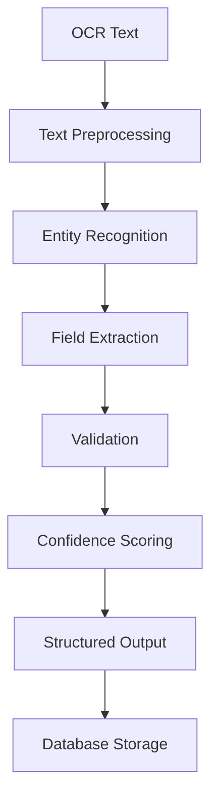
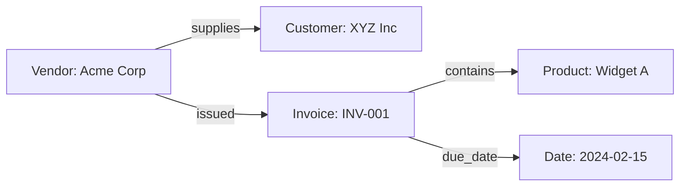

## Overview

The AI extraction layer transforms raw OCR text into structured, actionable data using advanced language models and custom-trained extraction pipelines. This system understands context, handles variations, and provides confidence scores for every extracted field.

## Extraction Pipeline



## AI Models Used

<CardGroup cols={2}>
  <Card title="OpenAI GPT-4" icon="openai">
    Primary extraction model for complex documents
  </Card>
  
  <Card title="Anthropic Claude" icon="robot">
    Fallback model for sensitive data extraction
  </Card>
  
  <Card title="Custom NER Models" icon="brain">
    Specialized models for industry-specific entities
  </Card>
  
  <Card title="LangChain Agents" icon="link">
    Orchestration and multi-step reasoning
  </Card>
</CardGroup>

## Extracted Data Types

### Invoice Fields

<Tabs>
  <Tab title="Header Information">
    ```json
    {
      "invoice_number": "INV-2024-001",
      "invoice_date": "2024-01-15",
      "due_date": "2024-02-15",
      "po_number": "PO-12345",
      "payment_terms": "Net 30"
    }
    ```
  </Tab>
  
  <Tab title="Vendor Details">
    ```json
    {
      "vendor_name": "Acme Corporation",
      "vendor_address": "123 Main St, City, State 12345",
      "vendor_tax_id": "12-3456789",
      "vendor_contact": "billing@acme.com",
      "vendor_phone": "+1-555-0123"
    }
    ```
  </Tab>
  
  <Tab title="Line Items">
    ```json
    {
      "items": [
        {
          "description": "Professional Services",
          "quantity": 10,
          "unit_price": 150.00,
          "tax_rate": 0.08,
          "line_total": 1620.00
        }
      ],
      "subtotal": 1500.00,
      "tax_amount": 120.00,
      "total_amount": 1620.00
    }
    ```
  </Tab>
</Tabs>

### Identity Document Fields

<AccordionGroup>
  <Accordion title="Personal Information" icon="user">
    - Full name
    - Date of birth
    - Gender
    - Nationality
    - Place of birth
  </Accordion>
  
  <Accordion title="Document Details" icon="id-card">
    - Document number
    - Issue date
    - Expiry date
    - Issuing authority
    - Document type
  </Accordion>
  
  <Accordion title="Biometric Data" icon="fingerprint">
    - Photo extraction
    - Signature detection
    - Height/Weight (if present)
    - Eye color
    - Distinguishing marks
  </Accordion>
</AccordionGroup>

## Extraction Techniques

### 1. Template-Based Extraction

For standardized documents with consistent layouts:

```python
template_config = {
    "invoice_number": {
        "patterns": ["Invoice #", "Invoice No.", "INV-"],
        "position": "top-right",
        "data_type": "alphanumeric"
    },
    "total_amount": {
        "patterns": ["Total:", "Amount Due:", "Grand Total:"],
        "position": "bottom",
        "data_type": "currency"
    }
}
```

### 2. AI-Powered Extraction

For complex or variable documents:

```python
prompt = """
Extract the following information from this invoice:
1. Invoice number
2. Date
3. Vendor name
4. Total amount
5. All line items with descriptions and amounts

Text: {ocr_text}
"""

response = llm.extract(prompt, schema=InvoiceSchema)
```

### 3. Hybrid Approach

Combines template matching with AI validation:

<Note>
  The hybrid approach achieves 99%+ accuracy by using templates for speed and AI for edge cases.
</Note>

## Confidence Scoring

Each extracted field includes a confidence score:

```json
{
  "invoice_number": {
    "value": "INV-2024-001",
    "confidence": 0.98,
    "source": "template_match",
    "alternatives": ["1NV-2024-001"]
  },
  "vendor_name": {
    "value": "Acme Corporation",
    "confidence": 0.95,
    "source": "ai_extraction",
    "alternatives": ["Acme Corp", "ACME CORPORATION"]
  }
}
```

### Confidence Thresholds

| Confidence | Action |
|------------|--------|
| > 0.95 | Auto-approve |
| 0.80-0.95 | Flag for review |
| < 0.80 | Manual review required |

## Advanced Features

### Multi-Language Extraction

<Card title="Language Detection" icon="language">
  Automatic language detection and extraction in 50+ languages:
  
  ```python
  detected_language = detect_language(ocr_text)
  extraction_model = get_model_for_language(detected_language)
  results = extraction_model.extract(ocr_text)
  ```
</Card>

### Context-Aware Extraction

The system understands document context:

- **Invoice Context**: Knows that "Net 30" means payment terms
- **Address Parsing**: Intelligently parses international addresses
- **Date Formats**: Handles MM/DD/YYYY, DD/MM/YYYY, ISO formats
- **Currency Detection**: Recognizes symbols and codes (USD, EUR, £, €)

### Relationship Extraction

Identifies relationships between entities:



## Validation Rules

### Built-in Validations

<Steps>
  <Step title="Format Validation">
    - Email addresses must be valid
    - Phone numbers checked against country codes
    - Tax IDs validated by country rules
  </Step>
  
  <Step title="Business Logic">
    - Invoice totals must match sum of line items
    - Dates must be logical (issue < due date)
    - Tax calculations verified
  </Step>
  
  <Step title="Cross-Reference">
    - Vendor names matched against database
    - Duplicate invoice detection
    - Historical data comparison
  </Step>
</Steps>

### Custom Validation Rules

```python
@validator
def validate_invoice_total(invoice):
    calculated = sum(item.total for item in invoice.items)
    if abs(calculated - invoice.total) > 0.01:
        raise ValidationError("Total mismatch")
    return True
```

## Integration with Business Systems

### AccountView Integration

Automatic journal entry creation:

```json
{
  "journal_entry": {
    "date": "2024-01-15",
    "description": "Invoice from Acme Corp",
    "debits": [
      {"account": "5000", "amount": 1500.00},
      {"account": "2300", "amount": 120.00}
    ],
    "credits": [
      {"account": "2000", "amount": 1620.00}
    ]
  }
}
```

### ERP Systems

<Tabs>
  <Tab title="SAP">
    ```xml
    <Invoice>
      <VendorCode>V12345</VendorCode>
      <DocumentNumber>INV-2024-001</DocumentNumber>
      <Amount>1620.00</Amount>
      <CostCenter>CC100</CostCenter>
    </Invoice>
    ```
  </Tab>
  
  <Tab title="Oracle">
    ```sql
    INSERT INTO ap_invoices (
      vendor_id, invoice_num, invoice_amount, 
      invoice_date, terms_id
    ) VALUES (
      12345, 'INV-2024-001', 1620.00, 
      '2024-01-15', 30
    );
    ```
  </Tab>
</Tabs>

## Performance Optimization

### Caching Strategy

```python
@cache(ttl=3600)
def extract_vendor_info(vendor_name):
    # Expensive extraction cached for 1 hour
    return ai_model.extract_vendor_details(vendor_name)
```

### Batch Processing

Process multiple documents efficiently:

```python
async def batch_extract(documents):
    tasks = [extract_document(doc) for doc in documents]
    results = await asyncio.gather(*tasks)
    return results
```

## API Usage Example

```bash
curl -X POST http://localhost:8000/api/v1/extract \
  -H "Authorization: Bearer YOUR_TOKEN" \
  -H "Content-Type: application/json" \
  -d '{
    "document_id": "doc_123",
    "extraction_type": "invoice",
    "options": {
      "include_confidence": true,
      "validate": true,
      "language": "auto"
    }
  }'
```

## Next Steps

<CardGroup cols={2}>
  <Card title="Neo4j Integration" icon="diagram-project" href="/3wm-project/features/neo4j">
    Learn about knowledge graph capabilities
  </Card>
  
  <Card title="Vector Search" icon="magnifying-glass" href="/3wm-project/features/vector-search">
    Explore semantic search features
  </Card>
</CardGroup> 