## Complete Invoice Processing Pipeline

Het 3WM systeem automatiseert het complete factuurverwerkingsproces met 99.9% nauwkeurigheid door gebruik te maken van geavanceerde AI embeddings en machine learning.

```mermaid
graph LR
    A[📧 Exchange Online] -->|Microsoft Graph API| B[🤖 AI Processing]
    B -->|6 AI Assistenten| C[📊 AccountView]
    
    style A fill:#e3f2fd
    style B fill:#fff3e0
    style C fill:#e8f5e9
```



## Waarom 99.9% Nauwkeurigheid?

### Het Geheim van Embeddings

<Tabs>
  <Tab title="❌ Oude Aanpak">
    **Rule-based Systemen (70-80% nauwkeurig)**
    - Zoekt naar exacte tekst: "Factuur"
    - Breekt bij kleine wijzigingen
    - Kan niet leren van fouten
    - Mist context en betekenis
  </Tab>
  
  <Tab title="✅ Onze Aanpak">
    **AI Embeddings (99.9% nauwkeurig)**
    - Begrijpt betekenis: "Factuur" = "Invoice" = "Rekening"
    - Herkent patronen ondanks variaties
    - Leert continu van elke factuur
    - Gebruikt historische context
  </Tab>
</Tabs>

### Hoe Embeddings Werken

<Steps>
  <Step title="Semantische Vingerafdruk">
    Elke factuur wordt omgezet in een 384-dimensionale vector die de "betekenis" vastlegt
  </Step>
  <Step title="Context Zoeken">
    Vindt de 10 meest vergelijkbare historische facturen in milliseconden
  </Step>
  <Step title="Patroon Aggregatie">
    Combineert geleerde patronen: GL-codes, BTW-tarieven, kostenplaatsen
  </Step>
  <Step title="Slimme Voorspelling">
    Maakt voorspelling met confidence score op basis van historische context
  </Step>
</Steps>

### Voorbeeld: Context in Actie

<Card title="🏢 Leverancier: Office Depot" icon="building">
Het systeem heeft geleerd uit 847 eerdere facturen:
- Altijd grootboek 4120 (Kantoorartikelen)
- BTW altijd 21%
- Bedragen tussen €50-€500
- Factuurnummer format: INV-2024-XXXXXX

**→ Nieuwe factuur: 98% zekerheid = Automatisch geboekt ✅**
</Card>

## Email Integratie

### Microsoft Graph API Koppeling
Het systeem monitort continu de Exchange Online inbox:

```python
# Automatische email verwerking
- Inbox: administratie@brouwer-group.nl
- Check interval: Real-time via webhooks
- Fallback: 5 minuten polling
- Attachment types: PDF, JPG, PNG, TIFF
```

### Email Classificatie
Intelligente herkenning van email types:

<CardGroup cols={3}>
  <Card title="Facturen" icon="file-invoice">
    Automatisch gedetecteerd en verwerkt
  </Card>
  <Card title="Herinneringen" icon="bell">
    Geflagd voor menselijke review
  </Card>
  <Card title="Overzichten" icon="file-lines">
    Opgeslagen voor analyse
  </Card>
</CardGroup>

## OCR & Data Extractie

### Multi-Engine OCR
```
DocTR Engine:
├── Automatische beeldverbetering
├── Scheefstand correctie
├── Ruisonderdrukking
└── Multi-taal support (NL/EN/DE)

Performance:
- 3-5 seconden per pagina
- 99.5% character accuracy
- Parallel processing
```

### Intelligente Field Extraction
Het systeem extraheert automatisch 20+ velden:

<Tabs>
  <Tab title="Leverancier Info">
    - Bedrijfsnaam
    - KVK nummer (met validatie)
    - BTW nummer (met verificatie)
    - Adresgegevens
    - IBAN/BIC
  </Tab>
  
  <Tab title="Factuur Details">
    - Factuurnummer
    - Factuurdatum
    - Vervaldatum
    - Referentienummer
    - Ordernummer
  </Tab>
  
  <Tab title="Financiële Data">
    - Subtotaal
    - BTW bedragen (per tarief)
    - Totaalbedrag
    - Valuta
    - Betalingscondities
  </Tab>
  
  <Tab title="Line Items">
    - Product/dienst omschrijving
    - Hoeveelheid
    - Eenheidsprijs
    - BTW percentage
    - Regeltotaal
  </Tab>
</Tabs>

## Human-in-the-Loop Workflow

### Confidence-Based Routing

<Info>
Het systeem bepaalt automatisch wanneer menselijke interventie nodig is op basis van confidence scores.

```mermaid
graph TD
    A[Factuur Verwerkt] --> B{Confidence Score}
    B -->|95-100%| C[✅ Automatisch Boeken<br/>~85% van facturen]
    B -->|80-94%| D[⚠️ Menselijke Controle<br/>~12% van facturen]
    B -->|&lt;80%| E[🔴 Handmatig Invoeren<br/>~3% van facturen]
    
    style C fill:#e8f5e9
    style D fill:#fff3e0
    style E fill:#ffebee
```

</Info>



### Scenario Voorbeelden

<Accordion title="✅ Scenario 1: Automatische Verwerking (98% Confidence)">
**Timeline:**
- 09:15:00 - Email ontvangen
- 09:15:03 - AI verwerkt factuur
- 09:15:08 - 98% confidence → Auto-book
- 09:15:10 - ✓ Geboekt in AccountView

*Geen menselijke interventie nodig - volledig geautomatiseerd*
</Accordion>

<Accordion title="⚠️ Scenario 2: Menselijke Verificatie (87% Confidence)">
**Timeline:**
- 10:30:00 - Email ontvangen
- 10:30:03 - AI verwerkt factuur
- 10:30:08 - 87% confidence → Review nodig
- 10:45:00 - 👤 Medewerker controleert
- 10:45:30 - ✓ Goedgekeurd & geboekt

*AI doet voorwerk, mens verifieert en keurt goed*
</Accordion>

<Accordion title="🚨 Scenario 3: Fraude Detectie">
**Timeline:**
- 14:20:00 - Email ontvangen
- 14:20:03 - AI verwerkt factuur
- 14:20:08 - 🚨 IBAN wijziging gedetecteerd
- 14:20:09 - ⚠️ Fraude risico: HOOG
- 14:20:15 - 👤 Manager gealarmeerd
- 14:25:00 - ❌ Factuur geweigerd

*AI voorkomt potentiële fraude door tijdige detectie*
</Accordion>

## Journaalpost Voorspelling

### Machine Learning Engine
Het systeem analyseert historische boekingen om patronen te herkennen:

```python
def predict_journal_entry(invoice_data):
    # 1. Vind vergelijkbare historische facturen
    similar_invoices = find_similar(invoice_data, limit=10)
    
    # 2. Analyseer boekingspatronen
    patterns = analyze_patterns(similar_invoices)
    
    # 3. Voorspel grootboekrekeningen
    gl_accounts = predict_accounts(patterns)
    
    # 4. Bepaal confidence score
    confidence = calculate_confidence(patterns)
    
    return JournalEntry(
        debit_account=gl_accounts['debit'],
        credit_account=gl_accounts['credit'],
        cost_center=patterns['cost_center'],
        confidence=confidence
    )
```

### AccountView Integratie
Naadloze export naar AccountView met:
- Correcte grootboekrekeningen
- Juiste kostenplaatsen
- BTW-codes en percentages
- Projecttoewijzingen

## Fraude Detectie

### Neo4j Graph Analysis
Real-time detectie van verdachte patronen:

<Warning>
Het systeem controleert 6 verschillende fraude-indicatoren bij elke factuur.
</Warning>

```
FRAUD_DETECTION_RULES {
  1. Vendor_Change_Detection    → IBAN wijzigingen
  2. Amount_Anomaly_Detection   → >3x standaard deviatie
  3. Duplicate_Invoice_Check    → Similarity > 0.95
  4. New_Vendor_Risk_Score      → Eerste 5 facturen
  5. Payment_Pattern_Analysis   → Timing afwijkingen
  6. Round_Number_Detection     → €1000.00 exact
}
```

### Risk Levels

<CardGroup cols={3}>
  <Card title="🔴 Hoog Risico" color="#ffcdd2">
    Onbekende leverancier + groot bedrag + spoed
  </Card>
  <Card title="🟡 Medium Risico" color="#fff9c4">
    IBAN wijziging bij bestaande leverancier
  </Card>
  <Card title="🟢 Laag Risico" color="#c8e6c9">
    Bekende leverancier, normaal patroon
  </Card>
</CardGroup>

## Performance Metrics

<CardGroup cols={4}>
  <Card title="10 sec" icon="clock">
    Gemiddelde verwerkingstijd
  </Card>
  <Card title="99.9%" icon="bullseye">
    Nauwkeurigheid
  </Card>
  <Card title="85%" icon="robot">
    Volledig geautomatiseerd
  </Card>
  <Card title="24/7" icon="server">
    Beschikbaarheid
  </Card>
</CardGroup>

## Batch Processing

### Nachtelijke Verwerking
Elke nacht om 2:00 AM draait een batch job voor bulk verwerking:

```bash
# Cron schedule
0 2 * * * python manage_documents.py process --all

# Proces flow:
1. Verzamel alle pending documenten
2. Sorteer chronologisch
3. Verwerk sequentieel
4. Genereer summary report
5. Email resultaten naar admin
```

### CLI Management
Handmatige controle via command line:

```bash
# Bekijk pending documenten
python manage_documents.py list --status=pending

# Verwerk specifiek document
python manage_documents.py process --id=INS_20240115_143052

# Toon statistieken
python manage_documents.py stats --month=current
``` 