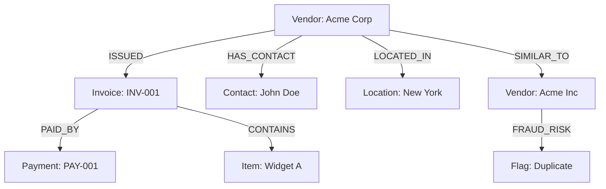

## Overview

The 3WM system leverages Neo4j's powerful graph database to create a comprehensive knowledge graph of vendors, documents, and their relationships. This enables advanced analytics, fraud detection, and relationship insights that would be impossible with traditional databases.

## Graph Architecture



## Node Types

<CardGroup cols={2}>
  <Card title="Vendor Nodes" icon="building">
    Companies and suppliers with rich metadata
  </Card>
  
  <Card title="Document Nodes" icon="file">
    Invoices, contracts, and other documents
  </Card>
  
  <Card title="Person Nodes" icon="user">
    Contacts, signatories, and stakeholders
  </Card>
  
  <Card title="Location Nodes" icon="location-dot">
    Addresses, regions, and jurisdictions
  </Card>
</CardGroup>

## Relationship Types

### Core Relationships

| Relationship | Description | Properties |
|--------------|-------------|------------|
| `ISSUED` | Vendor issued document | `date`, `amount` |
| `PAID_BY` | Payment for document | `date`, `method`, `amount` |
| `HAS_CONTACT` | Vendor contact person | `role`, `since` |
| `LOCATED_IN` | Physical location | `type`, `primary` |
| `SIMILAR_TO` | Similar entities | `similarity_score` |

### Fraud Detection Relationships

<Accordion title="Suspicious Patterns" icon="triangle-exclamation">
  - `DUPLICATE_OF`: Potential duplicate vendor
  - `SHARES_BANK_ACCOUNT`: Same payment details
  - `SHARES_TAX_ID`: Same tax identification
  - `UNUSUAL_PATTERN`: Anomalous behavior
  - `FRAUD_RISK`: Confirmed fraud indicator
</Accordion>

## Graph Queries

### Cypher Query Examples

<Tabs>
  <Tab title="Find Vendor Relationships">
    ```cypher
    MATCH (v:Vendor {name: 'Acme Corp'})-[r]->(n)
    RETURN v, type(r) as relationship, n
    LIMIT 25
    ```
  </Tab>
  
  <Tab title="Detect Duplicate Vendors">
    ```cypher
    MATCH (v1:Vendor)-[:SIMILAR_TO]->(v2:Vendor)
    WHERE v1.similarity_score > 0.9
    RETURN v1.name, v2.name, v1.similarity_score
    ORDER BY v1.similarity_score DESC
    ```
  </Tab>
  
  <Tab title="Payment Analysis">
    ```cypher
    MATCH (v:Vendor)-[:ISSUED]->(i:Invoice)-[:PAID_BY]->(p:Payment)
    WHERE p.date > date('2024-01-01')
    RETURN v.name, sum(p.amount) as total_paid, count(i) as invoice_count
    ORDER BY total_paid DESC
    ```
  </Tab>
</Tabs>

## Fraud Detection

### Pattern Recognition

The system automatically detects suspicious patterns:

<Steps>
  <Step title="Duplicate Detection">
    Identifies vendors with similar names, addresses, or tax IDs
  </Step>
  
  <Step title="Velocity Checks">
    Flags unusual invoice frequency or amount patterns
  </Step>
  
  <Step title="Network Analysis">
    Detects circular relationships and shell company structures
  </Step>
  
  <Step title="Behavioral Anomalies">
    Identifies deviations from historical patterns
  </Step>
</Steps>

### Risk Scoring

```python
def calculate_vendor_risk_score(vendor_id):
    query = """
    MATCH (v:Vendor {id: $vendor_id})
    OPTIONAL MATCH (v)-[:SIMILAR_TO]-(similar)
    OPTIONAL MATCH (v)-[:SHARES_BANK_ACCOUNT]-(shared)
    OPTIONAL MATCH (v)-[:UNUSUAL_PATTERN]-(anomaly)
    RETURN 
        count(DISTINCT similar) as duplicate_count,
        count(DISTINCT shared) as shared_account_count,
        count(DISTINCT anomaly) as anomaly_count
    """
    
    result = graph.run(query, vendor_id=vendor_id)
    # Calculate risk score based on indicators
    return risk_score
```

## Vendor Intelligence

### 360° Vendor View

<Card title="Comprehensive Profile" icon="circle-user">
  ```json
  {
    "vendor": {
      "id": "V12345",
      "name": "Acme Corporation",
      "risk_score": 0.15,
      "relationships": {
        "invoices": 127,
        "contacts": 3,
        "locations": 2,
        "similar_vendors": 1
      },
      "metrics": {
        "total_spend": 1250000,
        "avg_payment_days": 28,
        "dispute_rate": 0.02
      }
    }
  }
  ```
</Card>

### Relationship Insights

```cypher
// Find all paths between two vendors
MATCH path = (v1:Vendor {name: 'Vendor A'})-[*..3]-(v2:Vendor {name: 'Vendor B'})
RETURN path
```

## Graph Algorithms

### Community Detection

Identify vendor clusters and business networks:

```cypher
CALL gds.louvain.stream('vendor-graph')
YIELD nodeId, communityId
MATCH (v:Vendor) WHERE id(v) = nodeId
RETURN v.name, communityId
ORDER BY communityId
```

### PageRank Analysis

Find influential vendors in the network:

```cypher
CALL gds.pageRank.stream('vendor-graph')
YIELD nodeId, score
MATCH (v:Vendor) WHERE id(v) = nodeId
RETURN v.name, score
ORDER BY score DESC
LIMIT 10
```

### Similarity Algorithms

<AccordionGroup>
  <Accordion title="Jaccard Similarity" icon="equals">
    Compare vendors based on shared attributes
  </Accordion>
  
  <Accordion title="Cosine Similarity" icon="angle">
    Measure vendor similarity using vector embeddings
  </Accordion>
  
  <Accordion title="Node Similarity" icon="diagram-project">
    Find vendors with similar relationship patterns
  </Accordion>
</AccordionGroup>

## Integration Features

### Real-time Updates

```python
@event_handler('document.processed')
async def update_graph(document):
    # Extract vendor information
    vendor = extract_vendor(document)
    
    # Create or update vendor node
    await graph.merge_vendor(vendor)
    
    # Create document node and relationships
    await graph.create_document_relationships(document)
    
    # Run fraud detection
    await detect_fraud_patterns(vendor.id)
```

### GraphQL API

Query the graph using GraphQL:

```graphql
query VendorDetails($vendorId: ID!) {
  vendor(id: $vendorId) {
    name
    riskScore
    invoices {
      number
      amount
      status
    }
    relationships {
      type
      target {
        ... on Vendor {
          name
          riskScore
        }
      }
    }
  }
}
```

## Performance Optimization

### Indexing Strategy

```cypher
// Create indexes for common queries
CREATE INDEX vendor_name FOR (v:Vendor) ON (v.name);
CREATE INDEX invoice_number FOR (i:Invoice) ON (i.number);
CREATE INDEX payment_date FOR (p:Payment) ON (p.date);

// Composite indexes
CREATE INDEX vendor_location FOR (v:Vendor) ON (v.name, v.location);
```

### Query Optimization

<Note>
  Use query profiling to optimize complex traversals:
  
  ```cypher
  PROFILE MATCH (v:Vendor)-[:ISSUED]->(i:Invoice)
  WHERE i.amount > 10000
  RETURN v.name, count(i) as high_value_invoices
  ```
</Note>

## Visualization

### Graph Explorer

Interactive visualization of vendor networks:

- **Node Size**: Represents transaction volume
- **Edge Thickness**: Indicates relationship strength
- **Node Color**: Shows risk level (green to red)
- **Clustering**: Groups related vendors

### Dashboard Metrics

<CardGroup cols={2}>
  <Card title="Network Statistics" icon="chart-network">
    - Total nodes and relationships
    - Average degree connectivity
    - Network density
    - Clustering coefficient
  </Card>
  
  <Card title="Risk Indicators" icon="shield-exclamation">
    - High-risk vendor count
    - Suspicious patterns detected
    - Fraud alerts triggered
    - Compliance violations
  </Card>
</CardGroup>

## API Endpoints

### Graph Queries

```bash
# Get vendor relationships
GET /api/v1/graph/vendors/{vendor_id}/relationships

# Detect fraud patterns
POST /api/v1/graph/fraud/analyze
{
  "vendor_id": "V12345",
  "depth": 3,
  "include_similar": true
}

# Find similar vendors
GET /api/v1/graph/vendors/{vendor_id}/similar?threshold=0.8
```

## Next Steps

<CardGroup cols={2}>
  <Card title="Vector Search" icon="magnifying-glass" href="/3wm-project/features/vector-search">
    Combine graph insights with semantic search
  </Card>
  
  <Card title="API Documentation" icon="code" href="/3wm-project/api/endpoints/graph">
    Detailed graph API reference
  </Card>
</CardGroup> 