## Wat is 3WM?

3WM is een **AI-aangedreven document verwerkingssysteem** ontworpen om te revolutioneren hoe bedrijven omgaan met facturen, bonnetjes en financiële documenten. Het systeem extraheert automatisch data uit geüploade documenten, detecteert fraudepatronen en integreert met boekhoudsystemen zoals AccountView.

## Belangrijkste Business Voordelen

<CardGroup cols={3}>
  <Card title="10x Snellere Verwerking" icon="rocket">
    - **Traditioneel**: 5-10 minuten per document
    - **3WM**: 30-60 seconden per document
    - **Resultaat**: 90% tijdsbesparing
  </Card>
  
  <Card title="99%+ Nauwkeurigheid" icon="bullseye">
    - AI-powered OCR met confidence scores
    - Machine learning verbetert over tijd
    - Fraude detectie voorkomt kostbare fouten
  </Card>
  
  <Card title="Naadloze Integratie" icon="plug">
    - Direct verbonden met AccountView
    - Email processing voor automatische capture
    - Multi-database architectuur voor schaalbaarheid
  </Card>
</CardGroup>

## Hoe Het Werkt (In Eenvoudige Termen)

```mermaid
graph LR
    A[📧 Email/Upload] --> B[📄 Document]
    B --> C[🤖 AI Processing]
    C --> D[📊 Resultaten]
    D --> E[💼 AccountView]
    
    style A fill:#e3f2fd
    style C fill:#fff3e0
    style E fill:#e8f5e9
```

<Steps>
  <Step title="Document Input">
    Upload bestanden of verwerk automatisch email bijlagen
  </Step>
  <Step title="AI Analyse">
    Extraheer belangrijke data met geavanceerde OCR en machine learning
  </Step>
  <Step title="Slimme Verwerking">
    Voorspel boekingsregels en detecteer fraudepatronen
  </Step>
  <Step title="Business Output">
    Genereer journaalposten en inzichten voor boekhoudteams
  </Step>
</Steps>

## Core Features

### 📄 Document Verwerking
<Tabs>
  <Tab title="OCR Technologie">
    - Extraheert tekst uit PDFs en afbeeldingen met 99%+ nauwkeurigheid
    - Ondersteunt Nederlandse, Engelse en Duitse documenten
    - Automatische beeldverbetering voor optimale resultaten
  </Tab>
  
  <Tab title="Intelligente Classificatie">
    - Identificeert automatisch facturen, bonnetjes en certificaten
    - Leert van correcties en wordt steeds nauwkeuriger
    - Detecteert documenttype binnen 2 seconden
  </Tab>
  
  <Tab title="Multi-Format Support">
    - PDF, JPEG, PNG, TIFF en meer
    - Batch verwerking voor grote volumes
    - Automatische conversie en optimalisatie
  </Tab>
</Tabs>

### 🧠 AI Intelligentie

<CardGroup cols={2}>
  <Card title="Natural Language Queries" icon="comments">
    Stel vragen zoals:
    - "Toon facturen van Acme Corp vorige maand"
    - "Welke leveranciers zijn duurder geworden?"
    - "Hoeveel hebben we uitgegeven aan IT?"
  </Card>
  
  <Card title="Journal Entry Prediction" icon="calculator">
    - Automatisch voorstellen voor AccountView
    - 95%+ nauwkeurigheid voor bekende leveranciers
    - Leert van historische boekingspatronen
  </Card>
  
  <Card title="Fraud Detection" icon="shield">
    - Identificeert verdachte patronen
    - IBAN wijziging detectie
    - Nieuwe leverancier risico scoring
  </Card>
  
  <Card title="Smart Analytics" icon="chart-line">
    - Trend analyse per leverancier
    - Uitgaven categorisatie
    - Real-time dashboards
  </Card>
</CardGroup>

## Business Impact Metrics

### Processing Efficiency

<Info>
**Voor 3WM**: 100 facturen/dag met 2 full-time medewerkers  
**Met 3WM**: 1,000+ facturen/dag met 0.5 full-time toezicht  
**ROI**: 300% verbetering in verwerkingscapaciteit
</Info>

### Nauwkeurigheid & Compliance

| Metric | Performance |
|--------|-------------|
| Data Extractie | 99.2% nauwkeurigheid |
| Fraude Detectie | 95% verdachte patronen geïdentificeerd |
| Compliance | Volledige audit trail voor alle documenten |
| Processing Tijd | 30-60 seconden per document |

### Kostenbesparing

<CardGroup cols={3}>
  <Card title="80%" icon="user-minus">
    Reductie in handmatige data entry
  </Card>
  <Card title="90%" icon="exclamation-triangle">
    Reductie in verwerkingsfouten
  </Card>
  <Card title="Real-time" icon="clock">
    Verwerking vs. dagelijkse batches
  </Card>
</CardGroup>

## Technische Architectuur (Vereenvoudigd)

Het systeem gebruikt een **moderne microservices architectuur**:

<Card title="Technology Stack" icon="layer-group">
  - **FastAPI Backend**: High-performance Python web framework
  - **Neo4j Graph Database**: Opslag van leverancier relaties en fraude detectie
  - **PostgreSQL Database**: Gebruikersdata en document metadata
  - **Supabase Storage**: Veilige cloud opslag voor documenten
  - **OpenAI Integration**: AI analyse en natuurlijke taalverwerking
</Card>

## Getting Started

Het systeem is ontworpen voor **directe deployment**:

<Steps>
  <Step title="Docker Deployment">
    Single command setup voor productie
  </Step>
  <Step title="Cloud Ready">
    Volledig compatibel met moderne cloud platforms
  </Step>
  <Step title="API First">
    Eenvoudige integratie met bestaande systemen
  </Step>
  <Step title="Monitoring">
    Ingebouwde metrics en alerting
  </Step>
</Steps>

## Toekomst Roadmap

<Tabs>
  <Tab title="Q1 2024">
    - **Geavanceerde Analytics**: Business intelligence dashboards
    - **Performance Optimalisatie**: 2x snellere verwerking
  </Tab>
  
  <Tab title="Q2 2024">
    - **Meer Integraties**: Support voor extra boekhoudsystemen
    - **Enhanced AI**: Verbeterde voorspellingsmodellen
  </Tab>
  
  <Tab title="Q3 2024">
    - **Mobile App**: Field processing en approval workflows
    - **Advanced Automation**: Volledig autonome verwerking
  </Tab>
</Tabs>

<Warning>
Dit systeem vertegenwoordigt een significante vooruitgang in document verwerkingstechnologie, met meetbare business value door AI automatisering terwijl enterprise-grade security en compliance behouden blijft.
</Warning> 