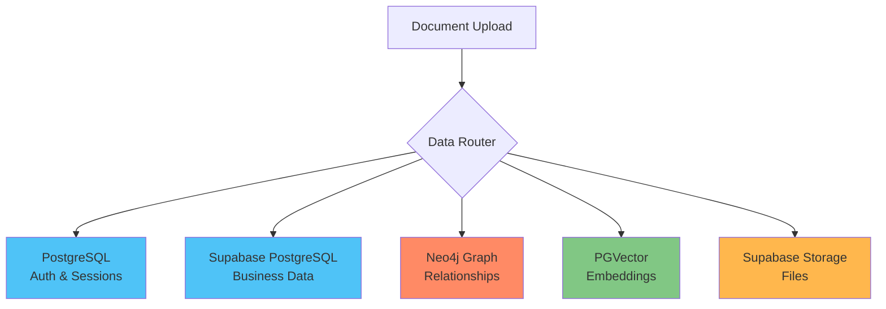
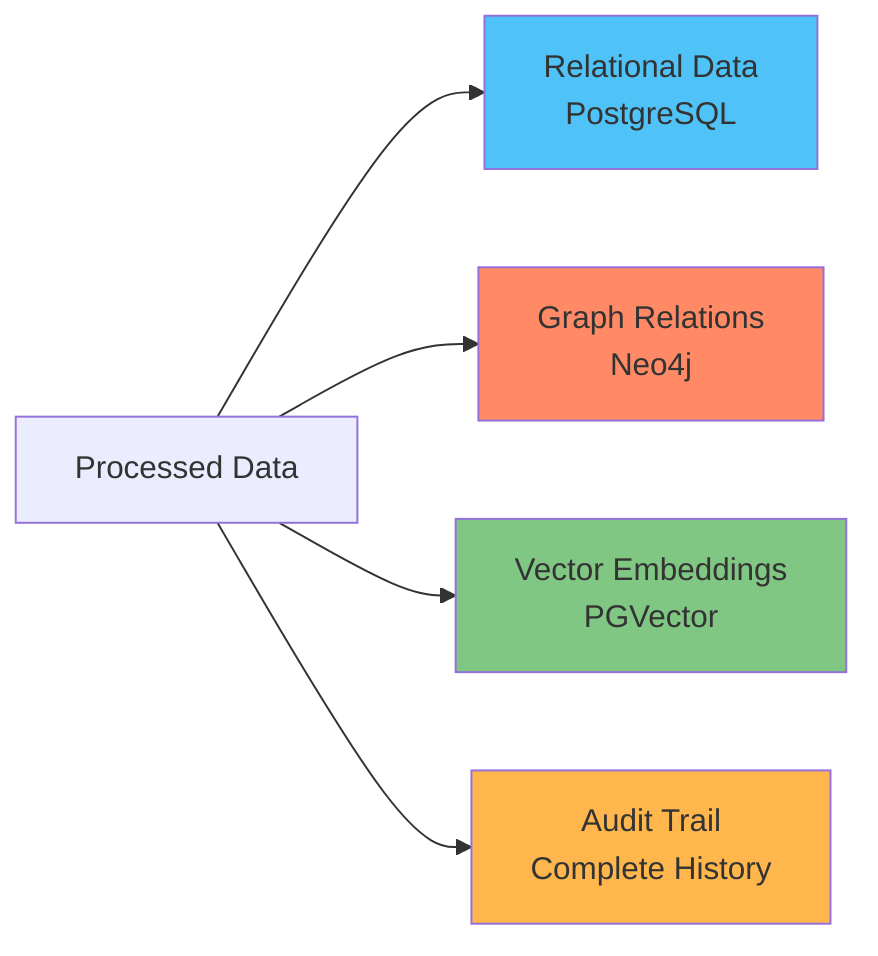

## Systeem Overzicht

Het 3WM AI Document Intelligence systeem is gebouwd op een **moderne, cloud-native architectuur** ontworpen voor schaalbaarheid, betrouwbaarheid en performance. Het systeem verwerkt documenten door een geavanceerde pipeline die OCR, machine learning en graph analytics combineert.

## Architectuur Componenten

### Core Application Layer

<CardGroup cols={2}>
  <Card title="FastAPI Framework" icon="bolt">
    High-performance Python web framework met async support
  </Card>
  <Card title="Uvicorn ASGI Server" icon="server">
    Production-ready async server voor optimale performance
  </Card>
  <Card title="Pydantic Models" icon="shield-check">
    Type-safe data validatie en serialisatie
  </Card>
  <Card title="SQLAlchemy ORM" icon="database">
    Database abstractie met migration support
  </Card>
</CardGroup>

### AI & Machine Learning Stack

<Tabs>
  <Tab title="Orchestration">
    - **LangChain/LangGraph**: AI agent orchestration framework
    - **Workflow Engine**: Complex multi-step processing
    - **Tool Integration**: 15+ specialized tools
  </Tab>
  <Tab title="Language Models">
    - **OpenAI GPT-4**: Natural language processing en reasoning
    - **OpenAI Embeddings**: Vector similarity search
    - **Claude 3**: Alternative LLM voor validatie
  </Tab>
  <Tab title="OCR Engines">
    - **DocTR**: Primaire OCR engine
    - **TrOCR**: Transformer-based OCR
    - **Tesseract**: Legacy fallback
  </Tab>
</Tabs>

### Database Architectuur

#### Primaire Databases



#### Data Flow

<Steps>
  <Step title="Document Upload">
    Gebruiker upload document via API
  </Step>
  <Step title="OCR Processing">
    Text extractie met DocTR/TrOCR
  </Step>
  <Step title="Data Extraction">
    AI extraheert gestructureerde data
  </Step>
  <Step title="Multiple Storage">
    - Document metadata → Supabase PostgreSQL
    - Vendor relationships → Neo4j Graph
    - Text embeddings → PGVector
    - Files → Supabase Storage
  </Step>
</Steps>

### Security & Authentication

<Info>
Het systeem implementeert defense-in-depth security met meerdere lagen van bescherming.
</Info>

<CardGroup cols={2}>
  <Card title="JWT Tokens" icon="key">
    - Stateless authentication
    - Refresh token mechanism
    - 24-uur expiry
  </Card>
  <Card title="Rate Limiting" icon="gauge">
    - SlowAPI integratie
    - Redis-like caching
    - Per-user throttling
  </Card>
  <Card title="CORS Configuration" icon="globe">
    - Cross-origin request handling
    - Whitelist based
    - Secure defaults
  </Card>
  <Card title="Input Validation" icon="shield">
    - Pydantic model validation
    - SQL injection protection
    - XSS prevention
  </Card>
</CardGroup>

### Monitoring & Observability

```yaml
# Monitoring Stack
Prometheus:
  - Custom metrics voor API performance
  - LLM cost tracking
  - Resource utilization
  
Grafana:
  - Real-time dashboards
  - Alert configuration
  - Historical analysis
  
Logging:
  - JSON-formatted logs
  - Request tracking
  - Error aggregation
```

## API Architectuur

### RESTful Design

Het API volgt REST principes met duidelijke resource-based endpoints:

```
/api/v1/
├── auth/          # Authentication endpoints
├── upload/        # Document upload en processing
├── graph/         # Neo4j graph operations
├── agent/         # AI agent natural language queries
└── email/         # Email processing endpoints
```

### Request/Response Flow

<Steps>
  <Step title="Authentication">
    JWT token validatie
  </Step>
  <Step title="Rate Limiting">
    Per-user request throttling
  </Step>
  <Step title="Input Validation">
    Pydantic model validatie
  </Step>
  <Step title="Processing">
    Business logic execution
  </Step>
  <Step title="Response">
    JSON serialisatie met error handling
  </Step>
</Steps>

## Document Processing Pipeline

### Stage 1: Document Ingestie

<Card title="Capabilities" icon="upload">
  - **File Upload**: Multi-format support (PDF, images)
  - **Validation**: File type, size, en security checks
  - **Storage**: Secure cloud storage met unique naming
  - **Metadata**: Initial document record creation
</Card>

### Stage 2: OCR Processing

<Tabs>
  <Tab title="Text Extraction">
    - DocTR/TrOCR voor high-accuracy
    - Multi-language support
    - Automatic preprocessing
  </Tab>
  <Tab title="Content Analysis">
    - Document type classification
    - Layout understanding
    - Table extraction
  </Tab>
  <Tab title="Quality Control">
    - Confidence scoring
    - Error handling
    - Fallback mechanisms
  </Tab>
</Tabs>

### Stage 3: AI Enhancement

<CardGroup cols={2}>
  <Card title="Field Extraction" icon="brain">
    Gestructureerde data extractie met AI
  </Card>
  <Card title="Similarity Analysis" icon="search">
    Vector embeddings voor document matching
  </Card>
  <Card title="Fraud Detection" icon="shield-exclamation">
    Pattern analyse voor risico assessment
  </Card>
  <Card title="Journal Prediction" icon="calculator">
    Accounting entry suggesties
  </Card>
</CardGroup>

### Stage 4: Data Storage



## AI Agent Architectuur

### LangChain/LangGraph Integration

<Info>
De AI Agent gebruikt een sophisticated tool-based architectuur voor flexibele query handling.
</Info>

```python
# Agent Tools
tools = [
    DocumentQueryTool(),      # Search documents
    VendorAnalysisTool(),    # Analyze vendors
    JournalPredictionTool(), # Predict entries
    StatisticsTool(),        # Generate stats
    WebSearchTool(),         # External data
]

# Agent Configuration
agent = LangGraphAgent(
    llm=ChatOpenAI(model="gpt-4-turbo"),
    tools=tools,
    memory=ConversationBufferMemory(),
)
```

### Query Processing Flow

<Steps>
  <Step title="Query Reception">
    Natural language query ontvangen
  </Step>
  <Step title="Intent Analysis">
    Bepaal user intent en required tools
  </Step>
  <Step title="Tool Selection">
    Selecteer relevante tools voor query
  </Step>
  <Step title="Parallel Execution">
    Voer tools parallel uit voor snelheid
  </Step>
  <Step title="Result Synthesis">
    Combineer resultaten tot coherent antwoord
  </Step>
</Steps>

## Performance Optimalisaties

### Caching Strategy

<Tabs>
  <Tab title="Redis Cache">
    ```python
    # Cache configuration
    CACHE_TTL = 3600  # 1 hour
    CACHE_KEY_PREFIX = "3wm:"
    
    # Cached items
    - User sessions
    - OCR results
    - AI responses
    - Vendor data
    ```
  </Tab>
  <Tab title="Database Indexes">
    ```sql
    -- Performance indexes
    CREATE INDEX idx_documents_user_created 
    ON documents(user_id, created_at DESC);
    
    CREATE INDEX idx_documents_status 
    ON documents(status) 
    WHERE status != 'completed';
    ```
  </Tab>
</Tabs>

### Async Processing

```python
# Async document processing
async def process_document(file: UploadFile):
    # Parallel operations
    tasks = [
        asyncio.create_task(store_file(file)),
        asyncio.create_task(extract_metadata(file)),
        asyncio.create_task(generate_thumbnail(file)),
    ]
    
    results = await asyncio.gather(*tasks)
    return combine_results(results)
```

## Scalability Design

### Horizontal Scaling

<CardGroup cols={3}>
  <Card title="API Servers" icon="server">
    - Load balanced
    - Auto-scaling
    - Health checks
  </Card>
  <Card title="Worker Pools" icon="users">
    - Background jobs
    - Queue-based
    - Priority handling
  </Card>
  <Card title="Database Sharding" icon="database">
    - Read replicas
    - Connection pooling
    - Query optimization
  </Card>
</CardGroup>

### Deployment Options

<Tabs>
  <Tab title="Docker Swarm">
    ```yaml
    # Swarm deployment
    deploy:
      replicas: 3
      update_config:
        parallelism: 1
        delay: 10s
      restart_policy:
        condition: on-failure
    ```
  </Tab>
  <Tab title="Kubernetes">
    ```yaml
    # K8s deployment
    spec:
      replicas: 3
      strategy:
        type: RollingUpdate
        rollingUpdate:
          maxSurge: 1
          maxUnavailable: 0
    ```
  </Tab>
</Tabs>

## Disaster Recovery

<Warning>
Implementeer altijd een comprehensive backup strategy voor production deployments.
</Warning>

### Backup Strategy

<Steps>
  <Step title="Database Backups">
    - Dagelijkse full backups
    - Hourly incrementals
    - Geographic replication
  </Step>
  <Step title="Document Storage">
    - S3 versioning enabled
    - Cross-region replication
    - 30-day retention
  </Step>
  <Step title="Configuration">
    - Git version control
    - Encrypted secrets
    - Infrastructure as Code
  </Step>
</Steps>

## Next Steps

<CardGroup cols={2}>
  <Card title="API Reference" icon="code" href="/3wm-project/implementation/api-documentation">
    Bekijk de complete API documentatie
  </Card>
  <Card title="Deployment Guide" icon="rocket" href="/3wm-project/implementation/deployment-guide">
    Start met deployment
  </Card>
</CardGroup> 