# System Architecture

## Overview

The 3WM AI Document Intelligence system is built on a modern, microservices-based architecture that leverages cutting-edge AI technologies, graph databases, and cloud services to deliver a robust document processing platform.

## Complete System Architecture

<Card>
The following diagram illustrates the complete system architecture, showing all layers, components, and their interactions:

```mermaid
graph TB
    subgraph "Frontend Layer"
        UI[Web UI<br/>index.html]
        API_DOCS[API Documentation<br/>Swagger/ReDoc]
    end

    subgraph "API Layer"
        FASTAPI[FastAPI Application<br/>app.main]
        
        subgraph "API Endpoints"
            AUTH[Auth API<br/>auth_supabase.py]
            UPLOAD[Upload API<br/>upload.py]
            AGENT_API[Agent API<br/>agent.py]
            GRAPH_API[Graph API<br/>graph.py]
            EMAIL_API[Email API<br/>email.py]
            ANALYTICS[Analytics API<br/>graph_analytics.py]
            SYNC[Sync API<br/>graph_sync.py]
        end
    end

    subgraph "AI Agents Layer"
        subgraph "Query Agent"
            QA_GRAPH[Query Agent Graph<br/>LangGraph]
            QA_NODES[Query Nodes<br/>parse/route/execute]
            QA_TOOLS[Query Tools<br/>document/vendor/stats]
        end
        
        subgraph "OCR Agent"
            OCR_GRAPH[OCR Agent Graph<br/>LangGraph]
            OCR_NODES[OCR Nodes<br/>vision/traditional/enhance]
            LLAMACLOUD[LlamaCloud Enhancement]
        end
    end

    subgraph "Business Logic Layer"
        subgraph "Document Processing"
            EXTRACTOR[Invoice Extractor]
            VALIDATOR[Document Validator]
            BATCH[Batch Processor]
            FILE_MGR[File Manager<br/>INS Naming]
        end
        
        subgraph "Accounting"
            JOURNAL[Journal Predictor]
        end
        
        subgraph "Email Processing"
            EMAIL_PROC[Email Processor]
            SCHEDULER[Job Scheduler]
        end
    end

    subgraph "Service Layer"
        DOC_SVC[Document Service]
        VENDOR_SVC[Vendor Service]
        JOURNAL_SVC[Journal Service]
    end

    subgraph "Data Layer"
        subgraph "Databases"
            SUPABASE[(Supabase<br/>PostgreSQL)]
            NEO4J[(Neo4j<br/>Graph DB)]
            REDIS[(Redis<br/>Cache)]
        end
        
        subgraph "Storage"
            STORAGE[Supabase Storage<br/>Document Files]
        end
    end

    subgraph "External Services"
        OPENAI[OpenAI API]
        TAVILY[Tavily Search API]
        LLAMACLOUD_API[LlamaCloud API]
        EMAIL_SVC[Email Service<br/>OAuth2]
    end

    subgraph "Infrastructure"
        DOCKER[Docker Containers]
        PROMETHEUS[Prometheus<br/>Monitoring]
    end

    %% Frontend connections
    UI --> FASTAPI
    API_DOCS --> FASTAPI

    %% API to endpoints
    FASTAPI --> AUTH
    FASTAPI --> UPLOAD
    FASTAPI --> AGENT_API
    FASTAPI --> GRAPH_API
    FASTAPI --> EMAIL_API
    FASTAPI --> ANALYTICS
    FASTAPI --> SYNC

    %% API to Agents
    AGENT_API --> QA_GRAPH
    UPLOAD --> OCR_GRAPH

    %% Agent internal flows
    QA_GRAPH --> QA_NODES
    QA_NODES --> QA_TOOLS
    OCR_GRAPH --> OCR_NODES
    OCR_NODES --> LLAMACLOUD

    %% Tools to Services
    QA_TOOLS --> DOC_SVC
    QA_TOOLS --> VENDOR_SVC
    QA_TOOLS --> JOURNAL_SVC

    %% Services to Business Logic
    DOC_SVC --> EXTRACTOR
    DOC_SVC --> VALIDATOR
    DOC_SVC --> BATCH
    DOC_SVC --> FILE_MGR
    VENDOR_SVC --> GRAPH_API
    JOURNAL_SVC --> JOURNAL

    %% Business Logic to Data
    EXTRACTOR --> SUPABASE
    VALIDATOR --> SUPABASE
    BATCH --> SUPABASE
    FILE_MGR --> STORAGE
    JOURNAL --> SUPABASE
    EMAIL_PROC --> SUPABASE

    %% Graph operations
    GRAPH_API --> NEO4J
    SYNC --> NEO4J
    SYNC --> SUPABASE
    ANALYTICS --> NEO4J

    %% External service connections
    OCR_NODES --> OPENAI
    LLAMACLOUD --> LLAMACLOUD_API
    QA_TOOLS --> TAVILY
    EMAIL_PROC --> EMAIL_SVC

    %% Cache layer
    FASTAPI --> REDIS
    DOC_SVC --> REDIS
    VENDOR_SVC --> REDIS

    %% Infrastructure
    FASTAPI --> PROMETHEUS
    SUPABASE --> DOCKER
    NEO4J --> DOCKER
    REDIS --> DOCKER

    %% Styling
    classDef api fill:#e1f5fe,stroke:#01579b,stroke-width:2px
    classDef agent fill:#f3e5f5,stroke:#4a148c,stroke-width:2px
    classDef service fill:#e8f5e9,stroke:#1b5e20,stroke-width:2px
    classDef data fill:#fff3e0,stroke:#e65100,stroke-width:2px
    classDef external fill:#fce4ec,stroke:#880e4f,stroke-width:2px
    classDef infra fill:#f5f5f5,stroke:#424242,stroke-width:2px

    class FASTAPI,AUTH,UPLOAD,AGENT_API,GRAPH_API,EMAIL_API,ANALYTICS,SYNC api
    class QA_GRAPH,QA_NODES,QA_TOOLS,OCR_GRAPH,OCR_NODES,LLAMACLOUD agent
    class DOC_SVC,VENDOR_SVC,JOURNAL_SVC,EXTRACTOR,VALIDATOR,BATCH,FILE_MGR,JOURNAL,EMAIL_PROC,SCHEDULER service
    class SUPABASE,NEO4J,REDIS,STORAGE data
    class OPENAI,TAVILY,LLAMACLOUD_API,EMAIL_SVC external
    class DOCKER,PROMETHEUS infra
```

</Card>

## Architecture Layers

### 1. Frontend Layer

<Card>
**User Interface Components**

The frontend layer provides the primary user interaction points:

- **Web UI**: Modern single-page application for document management
- **API Documentation**: Interactive Swagger/ReDoc interface for developers
</Card>

### 2. API Layer

<Tabs>
  <Tab title="Core Application">
    **FastAPI Application** (`app.main`)
    - High-performance async Python web framework
    - Automatic OpenAPI documentation generation
    - Built-in request validation
    - JWT authentication middleware
  </Tab>

  <Tab title="API Endpoints">
    **Authentication** (`auth_supabase.py`)
    - User registration and login
    - JWT token management
    - Session handling
    
    **Document Upload** (`upload.py`)
    - File upload handling
    - Format validation
    - Processing pipeline initiation
    
    **Agent API** (`agent.py`)
    - Natural language query interface
    - Streaming responses
    - Agent capabilities exposure
  </Tab>

  <Tab title="Graph & Analytics">
    **Graph API** (`graph.py`)
    - Vendor relationship queries
    - Fraud detection endpoints
    - Network visualization
    
    **Analytics API** (`graph_analytics.py`)
    - Business intelligence queries
    - Performance metrics
    - Trend analysis
    
    **Sync API** (`graph_sync.py`)
    - Database synchronization
    - Data consistency management
  </Tab>
</Tabs>

### 3. AI Agents Layer

<AccordionGroup>
  <Accordion title="Query Agent">
    **LangGraph-based Query Processing**
    
    Components:
    - **Query Agent Graph**: Orchestrates the query workflow
    - **Query Nodes**: Parse, route, and execute queries
    - **Query Tools**: Access document, vendor, and statistics data
    
    Features:
    - Natural language understanding
    - Multi-step reasoning
    - Context-aware responses
  </Accordion>

  <Accordion title="OCR Agent">
    **Advanced Document Recognition**
    
    Components:
    - **OCR Agent Graph**: Manages OCR workflow
    - **OCR Nodes**: Vision, traditional OCR, and enhancement
    - **LlamaCloud Enhancement**: AI-powered accuracy improvement
    
    Features:
    - Multi-engine OCR (vision + traditional)
    - Automatic quality enhancement
    - Confidence scoring
  </Accordion>
</AccordionGroup>

### 4. Business Logic Layer

<Card>
**Core Processing Components**

The business logic layer implements the domain-specific rules and workflows:
</Card>

#### Document Processing
- **Invoice Extractor**: Extracts structured data from invoices
- **Document Validator**: Validates extracted data against business rules
- **Batch Processor**: Handles bulk document processing
- **File Manager**: Implements INS naming convention and file organization

#### Accounting
- **Journal Predictor**: AI-powered GL code prediction

#### Email Processing
- **Email Processor**: Monitors and processes email attachments
- **Job Scheduler**: Manages background processing tasks

### 5. Service Layer

<Tabs>
  <Tab title="Document Service">
    Provides abstraction for document operations:
    - CRUD operations
    - Search functionality
    - Status tracking
    - Metadata management
  </Tab>

  <Tab title="Vendor Service">
    Manages vendor-related operations:
    - Vendor profile management
    - Relationship mapping
    - Risk scoring
    - Analytics
  </Tab>

  <Tab title="Journal Service">
    Handles accounting operations:
    - Journal entry creation
    - GL code mapping
    - AccountView integration
    - Validation rules
  </Tab>
</Tabs>

### 6. Data Layer

<AccordionGroup>
  <Accordion title="Databases">
    **Supabase (PostgreSQL)**
    - Primary relational database
    - User authentication
    - Document metadata
    - Vector embeddings for similarity search
    
    **Neo4j (Graph Database)**
    - Vendor relationships
    - Payment flow analysis
    - Fraud pattern detection
    - Network analytics
    
    **Redis (Cache)**
    - Session management
    - API response caching
    - Real-time data
    - Performance optimization
  </Accordion>

  <Accordion title="Storage">
    **Supabase Storage**
    - Document file storage
    - Secure access control
    - CDN integration
    - Automatic backups
  </Accordion>
</AccordionGroup>

### 7. External Services

<Card>
**Third-Party Integrations**

- **OpenAI API**: GPT-4 for document understanding and analysis
- **Tavily Search API**: Enhanced web search capabilities
- **LlamaCloud API**: Advanced OCR enhancement
- **Email Service (OAuth2)**: Secure email integration
</Card>

### 8. Infrastructure

<Tabs>
  <Tab title="Containerization">
    **Docker Containers**
    - Isolated service deployment
    - Consistent environments
    - Easy scaling
    - Version management
  </Tab>

  <Tab title="Monitoring">
    **Prometheus**
    - Real-time metrics collection
    - Performance monitoring
    - Alert management
    - Grafana integration
  </Tab>
</Tabs>

## Data Flow Examples

### Document Upload Flow

<Steps>
1. **User uploads document** via Web UI
2. **Upload API** validates file and initiates processing
3. **OCR Agent** extracts text using multiple engines
4. **LlamaCloud** enhances OCR accuracy
5. **Invoice Extractor** identifies fields
6. **Document Validator** checks business rules
7. **Data stored** in Supabase with vector embeddings
8. **File saved** to Supabase Storage
9. **Neo4j updated** with vendor relationships
10. **Cache updated** in Redis
</Steps>

### Natural Language Query Flow

<Steps>
1. **User enters query** in natural language
2. **Agent API** receives request
3. **Query Agent Graph** processes intent
4. **Query Nodes** parse and route query
5. **Query Tools** access relevant services
6. **Services query** databases (Supabase/Neo4j)
7. **Results formatted** and returned
8. **Response cached** in Redis
</Steps>

## Security Architecture

<Card>
**Multi-Layer Security**

1. **API Layer**: JWT authentication, rate limiting
2. **Service Layer**: Role-based access control
3. **Data Layer**: Encrypted connections, row-level security
4. **Infrastructure**: Container isolation, network policies
</Card>

## Scalability Design

The architecture supports horizontal scaling at multiple levels:

- **API Layer**: Multiple FastAPI instances behind load balancer
- **AI Agents**: Parallel processing with queue management
- **Databases**: Read replicas and sharding
- **Cache**: Redis cluster for distributed caching
- **Storage**: CDN integration for global file access

## Performance Optimizations

1. **Caching Strategy**
   - Redis for frequently accessed data
   - API response caching
   - Database query result caching

2. **Async Processing**
   - Non-blocking I/O operations
   - Background job processing
   - Event-driven architecture

3. **Database Optimization**
   - Indexed queries
   - Connection pooling
   - Query optimization

## Monitoring & Observability

<AccordionGroup>
  <Accordion title="Metrics Collection">
    - API response times
    - Document processing duration
    - Error rates and types
    - Database performance
    - External service latency
  </Accordion>

  <Accordion title="Logging">
    - Structured logging across all services
    - Centralized log aggregation
    - Error tracking and alerting
    - Audit trail maintenance
  </Accordion>

  <Accordion title="Tracing">
    - Distributed request tracing
    - Performance bottleneck identification
    - Service dependency mapping
    - User journey tracking
  </Accordion>
</AccordionGroup>

## Deployment Architecture

<Card>
**Production Deployment**

- **Container Orchestration**: Kubernetes for production
- **Service Mesh**: Istio for inter-service communication
- **API Gateway**: Kong for external API management
- **CI/CD**: GitLab CI/CD pipeline
- **Infrastructure as Code**: Terraform for cloud resources
</Card>

This architecture provides a robust, scalable, and maintainable foundation for the 3WM AI Document Intelligence system, enabling efficient document processing at enterprise scale while maintaining high security and performance standards. 