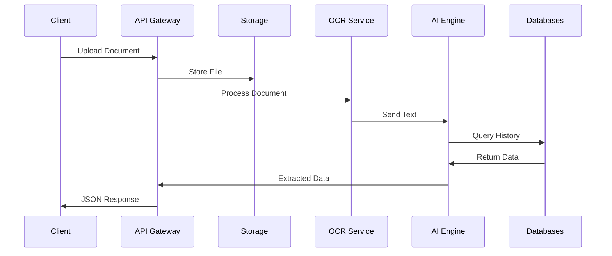

## Request Lifecycle

Understanding how data flows through the 3WM system from upload to final result.

## Document Upload Flow

<Steps>
  <Step title="File Upload">
    Client uploads document via REST API
  </Step>
  
  <Step title="Validation">
    File type, size, and virus scan checks
  </Step>
  
  <Step title="Storage">
    Document stored in Supabase storage
  </Step>
  
  <Step title="OCR Processing">
    Text extraction using DocTR/TrOCR
  </Step>
  
  <Step title="AI Extraction">
    LangGraph agents extract structured data
  </Step>
  
  <Step title="Enrichment">
    Neo4j graph adds vendor relationships
  </Step>
  
  <Step title="Validation">
    Business rules and fraud checks
  </Step>
  
  <Step title="Response">
    Structured JSON returned to client
  </Step>
</Steps>

## Data Flow Diagram



## Query Processing Flow

Natural language queries follow a different path:

1. **Query Reception**: API receives natural language query
2. **Context Loading**: Previous conversation loaded from cache
3. **Tool Selection**: AI agent selects appropriate tools
4. **Data Retrieval**: Query multiple data sources in parallel
5. **Response Generation**: Format results in natural language
6. **Context Update**: Save conversation state

## Async Processing

For large files or batch operations:

<CardGroup cols={2}>
  <Card title="Queue Processing" icon="list">
    Tasks added to Redis queue for background processing
  </Card>
  
  <Card title="Webhook Notification" icon="webhook">
    Results sent to configured webhook URL when complete
  </Card>
</CardGroup>

## Error Handling Flow

```python
try:
    result = await process_document(file)
except OCRError:
    # Retry with fallback engine
    result = await process_with_fallback(file)
except ValidationError as e:
    # Return specific error to client
    return error_response(e)
except Exception as e:
    # Log and return generic error
    logger.error(f"Processing failed: {e}")
    return generic_error_response()
```

## Performance Optimizations

- **Parallel Processing**: OCR and database queries run in parallel
- **Caching**: Frequent queries cached in Redis
- **Streaming**: Large responses streamed to client
- **Connection Pooling**: Reuse database connections

## Next Steps

- [Security Architecture](/3wm-project/architecture/security) - Security measures
- [API Overview](/3wm-project/api-reference/overview) - API design
- [Monitoring](/3wm-project/deployment/monitoring) - Performance tracking 