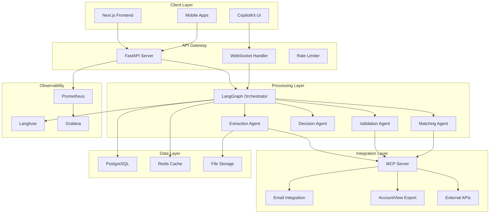
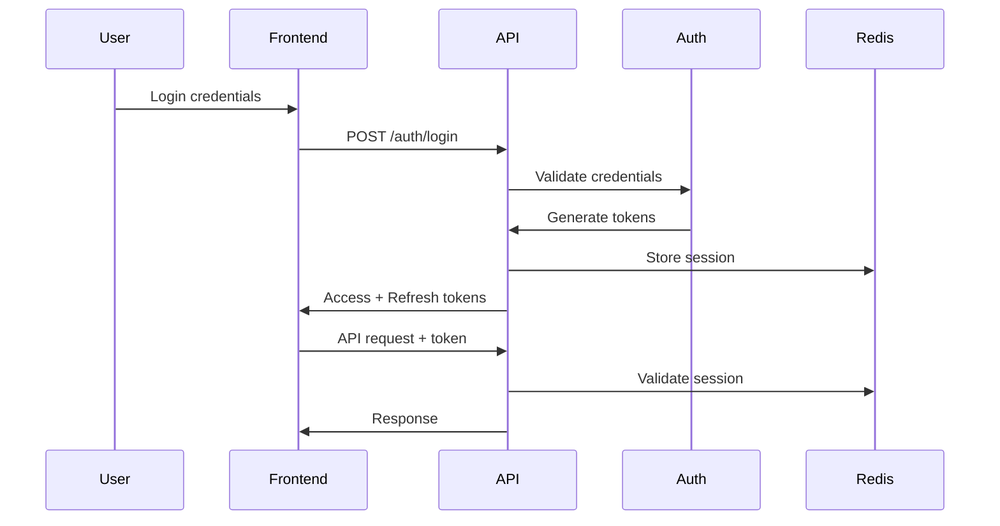

# Architecture Overview

3WM uses a modern microservices architecture built on FastAPI, LangGraph, and Model Context Protocol (MCP) to deliver scalable invoice automation.

## System Architecture



## Core Components

### 1. API Layer

<Card title="FastAPI Backend" icon="server">
  **High-performance async API server**
  
  - RESTful endpoints for all operations
  - WebSocket support for real-time updates
  - Automatic OpenAPI documentation
  - JWT authentication with refresh tokens
  - Rate limiting and request validation
  - CORS and security middleware
</Card>

### 2. AI Processing Layer

<Card title="LangGraph Orchestration" icon="diagram-project">
  **Stateful workflow management**
  
  - Directed graph for agent coordination
  - Shared state across all agents
  - Conditional routing based on confidence
  - Error handling and retries
  - Checkpoint persistence
  - Parallel agent execution
</Card>

### 3. Specialized Agents

<CardGroup cols={2}>
  <Card title="Extraction Agent" icon="scan">
    - PDF text extraction
    - OCR fallback
    - Field identification
    - Multi-language support
  </Card>
  
  <Card title="Validation Agent" icon="check">
    - Data validation
    - Business rule checks
    - Fraud detection
    - Confidence scoring
  </Card>
  
  <Card title="Matching Agent" icon="link">
    - 3-way matching logic
    - Tolerance handling
    - Discrepancy detection
    - Historical comparison
  </Card>
  
  <Card title="Decision Agent" icon="route">
    - Approval routing
    - Threshold evaluation
    - Exception handling
    - Workflow selection
  </Card>
</CardGroup>

### 4. Integration Layer

<Card title="Model Context Protocol (MCP)" icon="plug">
  **Unified tool interface for agents**
  
  - Web search capabilities
  - Database operations
  - External API calls
  - File system access
  - Standardized tool interface
  - Error handling
</Card>

## Data Architecture

### Primary Database (PostgreSQL)

```sql
-- Core tables managed by SQLModel
invoices
├── id (UUID)
├── invoice_number
├── vendor_id
├── status
├── extracted_data (JSONB)
├── confidence_scores (JSONB)
└── timestamps

purchase_orders
├── id (UUID)
├── po_number
├── vendor_id
├── items (JSONB)
└── approval_status

matching_results
├── invoice_id
├── po_id
├── receipt_id
├── match_confidence
└── discrepancies (JSONB)
```

### Caching Layer (Redis)

<Tabs>
  <Tab title="Session Cache">
    ```python
    # User sessions
    session:{user_id} → {
        "token": "...",
        "permissions": [...],
        "expires": "..."
    }
    ```
  </Tab>
  
  <Tab title="Data Cache">
    ```python
    # Vendor data cache
    vendor:{vat_number} → {
        "name": "...",
        "address": "...",
        "payment_terms": "..."
    }
    
    # PO cache for matching
    po:{po_number} → {
        "vendor_id": "...",
        "items": [...],
        "total": 0.00
    }
    ```
  </Tab>
  
  <Tab title="Rate Limiting">
    ```python
    # Rate limit tracking
    rate_limit:{user_id}:{endpoint} → {
        "count": 45,
        "window_start": "...",
        "expires": 60
    }
    ```
  </Tab>
</Tabs>

## Processing Pipeline

### Document Processing Flow

<Steps>
  <Step title="Ingestion">
    Document received via API or email → Stored in file system → Job queued
  </Step>
  
  <Step title="Extraction">
    PDF text extraction → OCR if needed → AI field extraction → Structured data
  </Step>
  
  <Step title="Validation">
    Format validation → Business rules → Duplicate check → Confidence scoring
  </Step>
  
  <Step title="Matching">
    Find related PO → Find goods receipt → 3-way comparison → Match scoring
  </Step>
  
  <Step title="Decision">
    Evaluate confidence → Apply thresholds → Route to workflow → Update status
  </Step>
  
  <Step title="Integration">
    Export to AccountView → Update systems → Send notifications → Archive
  </Step>
</Steps>

## Security Architecture

### Authentication Flow



### Security Layers

<CardGroup cols={2}>
  <Card title="Application Security" icon="shield">
    - JWT token validation
    - Role-based access control
    - Input sanitization
    - SQL injection prevention
  </Card>
  
  <Card title="Infrastructure Security" icon="lock">
    - HTTPS/TLS encryption
    - Firewall rules
    - VPC isolation
    - Secret management
  </Card>
</CardGroup>

## Scalability Design

### Horizontal Scaling

<Tabs>
  <Tab title="API Servers">
    ```yaml
    # Multiple API instances
    - Load balanced with nginx
    - Stateless design
    - Shared Redis sessions
    - Database connection pooling
    ```
  </Tab>
  
  <Tab title="Worker Processes">
    ```yaml
    # Background workers
    - Async job processing
    - Queue-based distribution
    - Auto-scaling based on load
    - Retry mechanisms
    ```
  </Tab>
  
  <Tab title="Database">
    ```yaml
    # PostgreSQL scaling
    - Read replicas
    - Connection pooling
    - Query optimization
    - Partitioning for large tables
    ```
  </Tab>
</Tabs>

### Performance Optimization

<CardGroup cols={3}>
  <Card title="Caching Strategy" icon="database">
    - Redis for hot data
    - Query result caching
    - Static asset CDN
    - Browser caching
  </Card>
  
  <Card title="Async Processing" icon="bolt">
    - Non-blocking I/O
    - Parallel agent execution
    - Batch operations
    - Background jobs
  </Card>
  
  <Card title="Resource Management" icon="gauge">
    - Connection pooling
    - Memory limits
    - CPU throttling
    - Rate limiting
  </Card>
</CardGroup>

## Monitoring & Observability

### Metrics Collection

```python
# Prometheus metrics
invoice_processing_duration_seconds
invoice_extraction_accuracy_percent
matching_success_rate
api_request_duration_seconds
api_request_total
llm_token_usage_total
```

### Observability Stack

<Steps>
  <Step title="Application Metrics">
    FastAPI → Prometheus → Grafana dashboards
  </Step>
  
  <Step title="LLM Observability">
    LangGraph → Langfuse → Performance analytics
  </Step>
  
  <Step title="Log Aggregation">
    JSON logs → Loki → Grafana exploration
  </Step>
  
  <Step title="Distributed Tracing">
    OpenTelemetry → Jaeger → Request flow visualization
  </Step>
</Steps>

## Deployment Architecture

### Container Structure

```yaml
services:
  api:
    image: 3wm-api:latest
    replicas: 3
    resources:
      limits:
        memory: 2Gi
        cpu: 1000m
  
  worker:
    image: 3wm-worker:latest
    replicas: 5
    resources:
      limits:
        memory: 4Gi
        cpu: 2000m
  
  mcp-server:
    image: 3wm-mcp:latest
    replicas: 2
    
  frontend:
    image: 3wm-frontend:latest
    replicas: 2
```

### High Availability

<Card title="HA Configuration" icon="shield-check">
  - Multi-AZ deployment
  - Auto-failover for databases
  - Load balancer health checks
  - Rolling updates
  - Backup and disaster recovery
  - 99.9% uptime SLA
</Card>

## Technology Decisions

### Why These Technologies?

<Tabs>
  <Tab title="FastAPI">
    - Async performance
    - Automatic validation
    - OpenAPI generation
    - Type safety
    - Easy testing
  </Tab>
  
  <Tab title="LangGraph">
    - Stateful workflows
    - Agent orchestration
    - Error handling
    - Checkpointing
    - Observable
  </Tab>
  
  <Tab title="PostgreSQL">
    - ACID compliance
    - JSON support
    - Full-text search
    - Reliability
    - Extensions
  </Tab>
  
  <Tab title="Next.js">
    - Server-side rendering
    - API routes
    - Image optimization
    - TypeScript support
    - Fast refresh
  </Tab>
</Tabs>

## Future Architecture

### Planned Enhancements

<CardGroup cols={2}>
  <Card title="Event-Driven Architecture" icon="bolt">
    - Apache Kafka integration
    - Event sourcing
    - CQRS pattern
    - Real-time streaming
  </Card>
  
  <Card title="ML Pipeline" icon="brain">
    - Custom model training
    - A/B testing framework
    - Feature store
    - Model versioning
  </Card>
</CardGroup>

## Next Steps

- [Component Details](/3wm-project/architecture/components) - Deep dive into components
- [Data Flow](/3wm-project/architecture/data-flow) - Request lifecycle
- [Security](/3wm-project/architecture/security) - Security implementation
- [Deployment](/3wm-project/deployment/overview) - Production deployment

---

*Built with ❤️ by [Sky Dust](https://skydust.io)* 