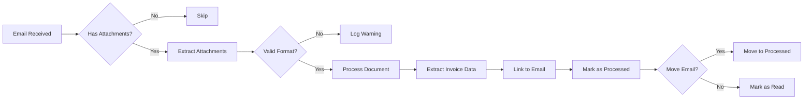

# Email Integration

3WM integrates with Microsoft Outlook to automatically process invoices received via email, eliminating manual document handling.

## Overview

<Card title="Automated Email Processing" icon="inbox">
  The system monitors designated email folders and automatically:
  
  - Detects and extracts invoice attachments
  - Processes PDFs, images, and other formats
  - Links invoices to email metadata
  - Maintains audit trail of email source
  - Handles multiple attachments per email
</Card>

## Microsoft Outlook Integration

### Prerequisites

<Steps>
  <Step title="Azure App Registration">
    Register an application in Azure AD for OAuth2 authentication
  </Step>
  
  <Step title="API Permissions">
    Grant Mail.Read and Mail.ReadWrite permissions
  </Step>
  
  <Step title="Configure Credentials">
    Add client ID, secret, and tenant ID to environment
  </Step>
</Steps>

### Configuration

Add to your `.env` file:

```env
# Microsoft Outlook Integration
OUTLOOK_CLIENT_ID=your-client-id
OUTLOOK_CLIENT_SECRET=your-client-secret
OUTLOOK_TENANT_ID=your-tenant-id
OUTLOOK_REDIRECT_URI=http://localhost:8000/auth/callback

# Email Processing Settings
EMAIL_POLL_INTERVAL=300  # Check every 5 minutes
EMAIL_FOLDER_NAME=Invoices  # Folder to monitor
EMAIL_PROCESS_UNREAD_ONLY=true
EMAIL_MARK_AS_READ=true
EMAIL_MOVE_PROCESSED=true
EMAIL_PROCESSED_FOLDER=Processed
```

## Email Processing Workflow



## Supported Email Scenarios

<Tabs>
  <Tab title="Direct Attachments">
    ```python
    # Standard invoice attachments
    - PDF invoices
    - Scanned images (JPG, PNG, TIFF)
    - Multi-page documents
    - Multiple invoices per email
    ```
  </Tab>
  
  <Tab title="Embedded Content">
    ```python
    # Invoice data in email body
    - HTML tables
    - Plain text formats
    - Embedded images
    - Inline PDF preview
    ```
  </Tab>
  
  <Tab title="Forwarded Emails">
    ```python
    # Handling forwarded invoices
    - Preserve original sender
    - Extract from forward chain
    - Handle .eml attachments
    - Maintain context
    ```
  </Tab>
</Tabs>

## Implementation

### Email Monitor Service

```python
class OutlookMonitor:
    """Monitor Outlook inbox for new invoices"""
    
    def __init__(self):
        self.client = OutlookClient(
            client_id=OUTLOOK_CLIENT_ID,
            client_secret=OUTLOOK_CLIENT_SECRET,
            tenant_id=OUTLOOK_TENANT_ID
        )
        
    async def process_inbox(self):
        """Process unread emails with attachments"""
        
        # Get unread messages
        messages = await self.client.get_messages(
            folder=EMAIL_FOLDER_NAME,
            filter="hasAttachments eq true and isRead eq false",
            top=50
        )
        
        for message in messages:
            try:
                await self.process_message(message)
            except Exception as e:
                logger.error(f"Failed to process {message.id}: {e}")
                
    async def process_message(self, message):
        """Process single email message"""
        
        # Extract metadata
        email_data = {
            "message_id": message.id,
            "sender": message.sender,
            "subject": message.subject,
            "received": message.received_datetime,
            "body_preview": message.body_preview
        }
        
        # Process each attachment
        for attachment in message.attachments:
            if self.is_valid_invoice(attachment):
                await self.process_attachment(attachment, email_data)
        
        # Mark as processed
        await self.mark_processed(message)
```

### Attachment Processing

```python
async def process_attachment(self, attachment, email_data):
    """Process email attachment as invoice"""
    
    # Save attachment
    file_path = await self.save_attachment(attachment)
    
    # Create document record
    document = await create_document(
        filename=attachment.name,
        source="email",
        metadata={
            "email_id": email_data["message_id"],
            "sender": email_data["sender"],
            "subject": email_data["subject"],
            "received_date": email_data["received"]
        }
    )
    
    # Process through standard pipeline
    result = await process_invoice(
        file_path=file_path,
        document_id=document.id,
        metadata=email_data
    )
    
    # Send confirmation if configured
    if EMAIL_SEND_CONFIRMATIONS:
        await self.send_confirmation(email_data["sender"], result)
    
    return result
```

## Email Rules & Filters

### Pre-processing Rules

<CardGroup cols={2}>
  <Card title="Sender Whitelist" icon="check">
    ```python
    TRUSTED_SENDERS = [
        "*@trustedvendor.com",
        "invoices@supplier.com",
        "*@*.accountingfirm.com"
    ]
    ```
  </Card>
  
  <Card title="Subject Filters" icon="filter">
    ```python
    INVOICE_SUBJECTS = [
        "invoice",
        "facture",
        "rechnung",
        "bill",
        "statement"
    ]
    ```
  </Card>
  
  <Card title="Attachment Rules" icon="paperclip">
    ```python
    VALID_EXTENSIONS = [
        ".pdf",
        ".jpg", ".jpeg",
        ".png",
        ".tiff", ".tif"
    ]
    MAX_ATTACHMENT_SIZE = 50 * 1024 * 1024  # 50MB
    ```
  </Card>
  
  <Card title="Spam Detection" icon="shield">
    ```python
    SPAM_INDICATORS = [
        "viagra",
        "lottery",
        "inheritance",
        "bitcoin"
    ]
    ```
  </Card>
</CardGroup>

### Smart Routing

```python
# Route based on email characteristics
ROUTING_RULES = {
    "high_priority": {
        "senders": ["cfo@company.com", "*@important-client.com"],
        "subjects": ["urgent", "immediate payment"],
        "action": "expedite_processing"
    },
    "recurring": {
        "senders": ["*@utility-company.com", "*@telecom.com"],
        "pattern": "monthly statement",
        "action": "auto_approve_if_similar"
    },
    "manual_review": {
        "conditions": ["first_time_sender", "unusual_amount"],
        "action": "flag_for_review"
    }
}
```

## Email Templates

### Confirmation Template

```html
Subject: Invoice Received - {{invoice_number}}

Dear {{sender_name}},

We have successfully received and processed your invoice:

Invoice Number: {{invoice_number}}
Amount: {{currency}} {{amount}}
Status: {{status}}

{{#if matched}}
✓ Successfully matched to PO {{po_number}}
{{else}}
⚠ Pending manual review - {{reason}}
{{/if}}

You can track the status at: {{tracking_url}}

Best regards,
Accounts Payable Team
```

### Error Notification

```html
Subject: Invoice Processing Error - {{subject}}

Dear {{sender_name}},

We encountered an issue processing your email attachment:

Error: {{error_message}}
File: {{filename}}

Please ensure:
- The attachment is a valid PDF or image
- The file is not corrupted
- The invoice is clearly readable

Please resend or contact support@company.com

Best regards,
AP Automation System
```

## Advanced Features

### Intelligent Parsing

<Tabs>
  <Tab title="Multi-language Support">
    ```python
    # Detect email language
    language = detect_language(email.body)
    
    # Use appropriate parser
    if language == "nl":
        parser = DutchInvoiceParser()
    elif language == "de":
        parser = GermanInvoiceParser()
    else:
        parser = DefaultInvoiceParser()
    ```
  </Tab>
  
  <Tab title="Thread Detection">
    ```python
    # Group related emails
    thread_id = extract_thread_id(email.headers)
    
    # Check for updates
    if existing_invoice := find_by_thread(thread_id):
        return update_invoice(existing_invoice, email)
    else:
        return create_new_invoice(email)
    ```
  </Tab>
  
  <Tab title="Duplicate Detection">
    ```python
    # Check for duplicates
    hash = calculate_attachment_hash(attachment)
    
    if existing := find_by_hash(hash):
        logger.info(f"Duplicate detected: {existing.id}")
        return link_email_to_existing(email, existing)
    ```
  </Tab>
</Tabs>

### Security Measures

<Card title="Email Security" icon="shield-check">
  - **SPF/DKIM Validation**: Verify sender authenticity
  - **Attachment Scanning**: Virus/malware detection
  - **Phishing Detection**: Identify suspicious patterns
  - **Encryption Support**: Handle S/MIME and PGP
  - **Audit Logging**: Complete email processing trail
</Card>

## Monitoring & Analytics

### Email Processing Metrics

```sql
-- Daily email processing stats
SELECT 
    DATE(processed_at) as date,
    COUNT(*) as emails_processed,
    SUM(attachment_count) as attachments_processed,
    AVG(processing_time_seconds) as avg_processing_time,
    SUM(CASE WHEN status = 'success' THEN 1 ELSE 0 END) as successful,
    SUM(CASE WHEN status = 'failed' THEN 1 ELSE 0 END) as failed
FROM email_processing_log
WHERE processed_at >= NOW() - INTERVAL '30 days'
GROUP BY DATE(processed_at)
ORDER BY date DESC;
```

### Sender Analytics

```sql
-- Top senders by volume
SELECT 
    sender_domain,
    COUNT(*) as invoice_count,
    SUM(total_amount) as total_value,
    AVG(processing_confidence) as avg_confidence
FROM email_invoices
WHERE created_at >= NOW() - INTERVAL '90 days'
GROUP BY sender_domain
ORDER BY invoice_count DESC
LIMIT 20;
```

## Best Practices

<Steps>
  <Step title="Dedicated Email Address">
    Use a dedicated email address for invoice processing (e.g., invoices@company.com)
  </Step>
  
  <Step title="Clear Instructions">
    Provide vendors with clear email submission guidelines
  </Step>
  
  <Step title="Regular Monitoring">
    Monitor failed processing and adjust rules accordingly
  </Step>
  
  <Step title="Backup Strategy">
    Keep processed emails for audit trail and recovery
  </Step>
  
  <Step title="Security First">
    Implement strict validation and security measures
  </Step>
</Steps>

## Troubleshooting

<AccordionGroup>
  <Accordion title="Emails not being processed">
    - Check OAuth token is valid
    - Verify folder name is correct
    - Ensure service is running
    - Check email filters
  </Accordion>
  
  <Accordion title="Attachments failing">
    - Verify file format is supported
    - Check file size limits
    - Ensure attachment isn't corrupted
    - Review processing logs
  </Accordion>
  
  <Accordion title="Authentication issues">
    - Refresh OAuth tokens
    - Verify Azure AD permissions
    - Check tenant configuration
    - Review auth logs
  </Accordion>
</AccordionGroup>

## Next Steps

- [API Reference](/3wm-project/api-reference/email) - Email API endpoints
- [Configuration](/3wm-project/getting-started/configuration) - Detailed setup
- [Best Practices](/3wm-project/guides/best-practices) - Email tips

---

*Built with ❤️ by [Sky Dust](https://skydust.io)* 