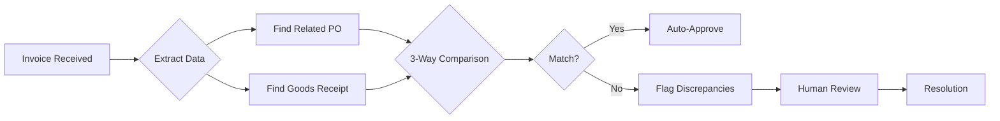

# 3-Way Matching

3WM's intelligent 3-way matching system automatically validates invoices by comparing them against purchase orders and goods receipts, ensuring accuracy and preventing fraud.

## What is 3-Way Matching?

<Card title="Definition" icon="info-circle">
  3-way matching is an accounts payable process that compares three documents before approving payment:
  
  1. **Purchase Order (PO)** - What was ordered
  2. **Goods Receipt** - What was received
  3. **Invoice** - What the vendor is billing
  
  All three must match within defined tolerances for automatic approval.
</Card>

## Matching Process



## Matching Components

### 1. Purchase Order Matching

<Tabs>
  <Tab title="Fields Matched">
    ```json
    {
      "po_number": "Exact match required",
      "vendor_id": "Must match registered vendor",
      "currency": "Must be identical",
      "payment_terms": "Should align",
      "line_items": {
        "product_code": "Exact or mapped match",
        "quantity": "Within tolerance",
        "unit_price": "Within tolerance",
        "description": "Fuzzy match allowed"
      }
    }
    ```
  </Tab>
  
  <Tab title="Matching Logic">
    ```python
    def match_invoice_to_po(invoice, po):
        """Match invoice against purchase order"""
        
        # Exact matches required
        if invoice.po_number != po.number:
            return MatchResult(matched=False, reason="PO number mismatch")
        
        if invoice.vendor_id != po.vendor_id:
            return MatchResult(matched=False, reason="Vendor mismatch")
        
        # Tolerance-based matching
        total_variance = abs(invoice.total - po.total) / po.total
        if total_variance > TOLERANCE_PERCENTAGE:
            return MatchResult(
                matched=False, 
                reason=f"Total variance {total_variance:.2%} exceeds tolerance"
            )
        
        # Line item matching
        line_matches = match_line_items(invoice.items, po.items)
        
        return MatchResult(
            matched=line_matches.all_matched,
            confidence=line_matches.confidence,
            details=line_matches.details
        )
    ```
  </Tab>
</Tabs>

### 2. Goods Receipt Matching

<Card title="Receipt Validation" icon="truck">
  Ensures that invoiced items were actually received:
  
  - **Delivery Reference**: Links invoice to specific delivery
  - **Quantity Verification**: Invoiced ≤ Received
  - **Date Validation**: Invoice date ≥ Receipt date
  - **Quality Checks**: No rejected items invoiced
</Card>

### 3. Line Item Matching

The system performs intelligent line-by-line comparison:

```python
def match_line_items(invoice_items, po_items):
    """Intelligent line item matching with fuzzy logic"""
    
    matches = []
    unmatched_invoice = list(invoice_items)
    unmatched_po = list(po_items)
    
    # Phase 1: Exact product code matches
    for inv_item in invoice_items:
        for po_item in po_items:
            if inv_item.product_code == po_item.product_code:
                match = compare_items(inv_item, po_item)
                matches.append(match)
                unmatched_invoice.remove(inv_item)
                unmatched_po.remove(po_item)
                break
    
    # Phase 2: Fuzzy description matching
    for inv_item in unmatched_invoice[:]:
        best_match = find_best_description_match(
            inv_item, 
            unmatched_po,
            threshold=0.85
        )
        if best_match:
            match = compare_items(inv_item, best_match)
            matches.append(match)
            unmatched_invoice.remove(inv_item)
            unmatched_po.remove(best_match)
    
    return LineMatchResult(
        matches=matches,
        unmatched_invoice=unmatched_invoice,
        unmatched_po=unmatched_po
    )
```

## Tolerance Configuration

### Standard Tolerances

<CardGroup cols={2}>
  <Card title="Amount Tolerances" icon="dollar">
    ```yaml
    amount_tolerance:
      percentage: 5.0  # 5% variance allowed
      absolute: 100    # Or €100 absolute
      use_lesser: true # Use lesser of % or absolute
    ```
  </Card>
  
  <Card title="Quantity Tolerances" icon="boxes">
    ```yaml
    quantity_tolerance:
      percentage: 2.0  # 2% variance allowed
      absolute: 5      # Or 5 units absolute
      round_to: 1      # Round to nearest unit
    ```
  </Card>
  
  <Card title="Price Tolerances" icon="tag">
    ```yaml
    price_tolerance:
      percentage: 3.0  # 3% price variance
      absolute: 10     # Or €10 per unit
      consider_discounts: true
    ```
  </Card>
  
  <Card title="Date Tolerances" icon="calendar">
    ```yaml
    date_tolerance:
      invoice_before_receipt: 30  # Days
      invoice_after_po: 180       # Days
      early_payment_discount: 10  # Days
    ```
  </Card>
</CardGroup>

### Custom Rules

Configure vendor-specific or category-specific rules:

```python
CUSTOM_MATCHING_RULES = {
    "vendor_categories": {
        "strategic_suppliers": {
            "amount_tolerance_percentage": 10.0,
            "auto_approve_limit": 50000,
            "require_receipt": False
        },
        "new_vendors": {
            "amount_tolerance_percentage": 0.0,
            "auto_approve_limit": 1000,
            "require_receipt": True,
            "require_manual_review": True
        }
    },
    "product_categories": {
        "services": {
            "quantity_matching": False,
            "description_matching": "fuzzy",
            "receipt_required": False
        },
        "raw_materials": {
            "quantity_tolerance_percentage": 1.0,
            "price_tolerance_percentage": 2.0,
            "receipt_required": True
        }
    }
}
```

## Discrepancy Handling

### Common Discrepancies

<Tabs>
  <Tab title="Price Discrepancies">
    ```python
    class PriceDiscrepancy:
        def analyze(self, invoice_price, po_price):
            variance = (invoice_price - po_price) / po_price
            
            if variance > 0.10:  # >10% increase
                return {
                    "severity": "high",
                    "action": "block_payment",
                    "notification": "finance_manager",
                    "reason": f"Price increased by {variance:.1%}"
                }
            elif variance > 0.05:  # 5-10% increase
                return {
                    "severity": "medium",
                    "action": "flag_review",
                    "notification": "purchaser",
                    "reason": f"Price variance {variance:.1%}"
                }
    ```
  </Tab>
  
  <Tab title="Quantity Discrepancies">
    ```python
    class QuantityDiscrepancy:
        def analyze(self, invoiced_qty, received_qty):
            if invoiced_qty > received_qty:
                return {
                    "severity": "high",
                    "action": "block_payment",
                    "reason": "Invoiced more than received",
                    "adjustment": received_qty - invoiced_qty
                }
            elif invoiced_qty < received_qty * 0.95:
                return {
                    "severity": "low",
                    "action": "flag_info",
                    "reason": "Partial invoice",
                    "expected_future": received_qty - invoiced_qty
                }
    ```
  </Tab>
  
  <Tab title="Missing Documents">
    ```python
    class MissingDocumentHandler:
        def handle_missing_po(self, invoice):
            if invoice.total < 1000:
                return {
                    "action": "create_retroactive_po",
                    "approval": "department_head"
                }
            else:
                return {
                    "action": "block_payment",
                    "escalation": "procurement_manager",
                    "reason": "No PO for large invoice"
                }
        
        def handle_missing_receipt(self, invoice):
            if invoice.category == "services":
                return {"action": "proceed", "note": "Services - no receipt required"}
            else:
                return {"action": "request_receipt", "deadline_days": 5}
    ```
  </Tab>
</Tabs>

### Resolution Workflows

<Steps>
  <Step title="Automatic Resolution">
    System attempts automatic resolution for minor discrepancies:
    - Round-off differences
    - Known vendor pricing updates
    - Approved substitutions
  </Step>
  
  <Step title="Guided Resolution">
    For medium severity issues, guide users through resolution:
    - Suggest likely causes
    - Provide historical context
    - Offer quick actions
  </Step>
  
  <Step title="Escalation">
    High severity or repeated issues trigger escalation:
    - Notify appropriate managers
    - Block payment if needed
    - Create audit trail
  </Step>
</Steps>

## Performance Optimization

### Intelligent Caching

```python
class MatchingCache:
    """Cache frequently accessed data for faster matching"""
    
    def __init__(self):
        self.po_cache = TTLCache(maxsize=1000, ttl=3600)
        self.vendor_cache = TTLCache(maxsize=500, ttl=7200)
        self.product_cache = TTLCache(maxsize=2000, ttl=3600)
    
    async def get_po(self, po_number: str):
        if po_number in self.po_cache:
            return self.po_cache[po_number]
        
        po = await db.get_purchase_order(po_number)
        self.po_cache[po_number] = po
        return po
```

### Batch Processing

```python
async def batch_match_invoices(invoices: List[Invoice]):
    """Process multiple invoices efficiently"""
    
    # Pre-load all related POs and receipts
    po_numbers = {inv.po_number for inv in invoices}
    pos = await db.get_purchase_orders_batch(po_numbers)
    
    # Process in parallel
    tasks = [
        match_invoice(invoice, pos.get(invoice.po_number))
        for invoice in invoices
    ]
    
    results = await asyncio.gather(*tasks)
    return results
```

## Analytics & Reporting

### Key Metrics

<CardGroup cols={3}>
  <Card title="Match Rate" icon="percentage">
    Track percentage of invoices successfully matched
  </Card>
  
  <Card title="Auto-Approval Rate" icon="check-circle">
    Monitor automation effectiveness
  </Card>
  
  <Card title="Discrepancy Patterns" icon="chart-line">
    Identify recurring issues by vendor/category
  </Card>
</CardGroup>

### Dashboard Views

```sql
-- Match rate by vendor
SELECT 
    v.name as vendor_name,
    COUNT(*) as total_invoices,
    SUM(CASE WHEN m.status = 'matched' THEN 1 ELSE 0 END) as matched,
    AVG(m.confidence_score) as avg_confidence
FROM invoices i
JOIN vendors v ON i.vendor_id = v.id
JOIN matching_results m ON i.id = m.invoice_id
WHERE i.created_at >= NOW() - INTERVAL '30 days'
GROUP BY v.name
ORDER BY total_invoices DESC;

-- Common discrepancy types
SELECT 
    discrepancy_type,
    COUNT(*) as occurrences,
    AVG(resolution_time_hours) as avg_resolution_time
FROM matching_discrepancies
WHERE created_at >= NOW() - INTERVAL '30 days'
GROUP BY discrepancy_type
ORDER BY occurrences DESC;
```

## Best Practices

<Steps>
  <Step title="Maintain Clean Master Data">
    - Keep vendor information updated
    - Standardize product codes
    - Regular PO cleanup
  </Step>
  
  <Step title="Configure Appropriate Tolerances">
    - Start conservative, relax gradually
    - Different rules for different vendors
    - Monitor and adjust based on results
  </Step>
  
  <Step title="Handle Exceptions Promptly">
    - Quick resolution prevents backlogs
    - Learn from repeated issues
    - Update rules based on patterns
  </Step>
  
  <Step title="Regular Audits">
    - Sample check auto-approved invoices
    - Review tolerance effectiveness
    - Ensure compliance
  </Step>
</Steps>

## Integration Points

<Card title="ERP Integration" icon="plug">
  The 3-way matching system integrates with:
  
  - **Purchase Order Systems**: Real-time PO retrieval
  - **Warehouse Management**: Goods receipt data
  - **Accounting Systems**: Approval status updates
  - **Payment Systems**: Release approved payments
  - **Reporting Tools**: Analytics and dashboards
</Card>

## Next Steps

- [API Reference](/3wm-project/api-reference/matching) - Matching API endpoints
- [Best Practices](/3wm-project/guides/best-practices) - Optimization tips
- [Document Processing](/3wm-project/features/document-processing) - Processing pipeline

---

*Built with ❤️ by [Sky Dust](https://skydust.io)* 