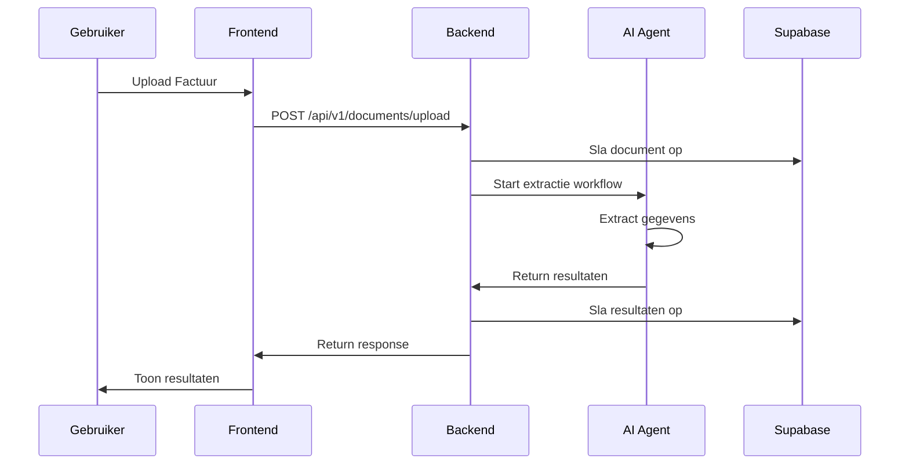

# Snelstart: 3WM in 5 Minuten

Deze gids helpt je om snel aan de slag te gaan met 3WM met behulp van Docker Compose.

## Vereisten

<Card title="Wat je nodig hebt" icon="list-check">
  - Docker en Docker Compose geïnstalleerd
  - Supabase account (gratis tier is voldoende)
  - OpenAI of Anthropic API sleutel
  - 8GB RAM minimum
</Card>

## Stap 1: Clone de Repository

```bash
# Clone de 3WM backend repository
git clone https://github.com/sky-dust-intelligence/3wm-backend.git
cd 3wm-backend

# Clone de frontend repository
git clone https://github.com/sky-dust-intelligence/3wm-frontend.git
```

## Stap 2: Configureer Omgevingsvariabelen

Maak een `.env` bestand in de backend directory:

```bash
# Supabase Configuratie
SUPABASE_URL=https://jouw-project.supabase.co
SUPABASE_ANON_KEY=jouw-anon-key
SUPABASE_SERVICE_KEY=jouw-service-key

# AI Model Configuratie
OPENAI_API_KEY=sk-...
# Of gebruik Anthropic
ANTHROPIC_API_KEY=sk-ant-...

# Applicatie Configuratie
SECRET_KEY=genereer-een-veilige-sleutel
ENVIRONMENT=development
DEBUG=true

# Redis Configuratie (optioneel voor development)
REDIS_URL=redis://localhost:6379

# Microsoft Outlook (optioneel)
OUTLOOK_CLIENT_ID=jouw-client-id
OUTLOOK_CLIENT_SECRET=jouw-client-secret
```

<Accordion title="Supabase Setup Instructies">
  1. Ga naar [supabase.com](https://supabase.com) en maak een account
  2. Maak een nieuw project
  3. Ga naar Settings → API
  4. Kopieer de URL, anon key, en service role key
  5. Voeg deze toe aan je `.env` bestand
</Accordion>

## Stap 3: Start de Services

```bash
# Start alle services met Docker Compose
docker-compose up -d

# Controleer of alles draait
docker-compose ps
```

Dit start:
- 3WM Backend API (port 8000)
- 3WM Frontend (port 3000)
- Redis Cache
- Langfuse voor monitoring (port 3001)

## Stap 4: Initialiseer de Database

```bash
# Voer database migraties uit
docker-compose exec backend python -m alembic upgrade head

# Maak een test gebruiker (optioneel)
docker-compose exec backend python scripts/create_user.py
```

## Stap 5: Test de Installatie

<Tabs>
  <Tab title="Via Web UI">
    1. Open http://localhost:3000 in je browser
    2. Log in met de test credentials
    3. Upload een test factuur
    4. Bekijk de AI-extractie resultaten
  </Tab>
  
  <Tab title="Via API">
    ```bash
    # Health check
    curl http://localhost:8000/health
    
    # Upload een factuur
    curl -X POST http://localhost:8000/api/v1/documents/upload \
      -H "Authorization: Bearer <token>" \
      -F "file=@factuur.pdf"
    ```
  </Tab>
  
  <Tab title="Via Python">
    ```python
    import requests
    
    # Authenticatie
    response = requests.post("http://localhost:8000/api/v1/auth/login", 
        json={"username": "test", "password": "test123"})
    token = response.json()["access_token"]
    
    # Upload document
    files = {"file": open("factuur.pdf", "rb")}
    headers = {"Authorization": f"Bearer {token}"}
    response = requests.post(
        "http://localhost:8000/api/v1/documents/upload",
        files=files,
        headers=headers
    )
    print(response.json())
    ```
  </Tab>
</Tabs>

## Volgende Stappen

<Steps>
  <Step title="Configureer AI Agents">
    Pas de agent configuratie aan in `config/agents.yaml` voor jouw use case
  </Step>
  
  <Step title="Setup E-mail Integratie">
    Configureer Microsoft Outlook voor automatische factuurverwerking
  </Step>
  
  <Step title="Configureer 3-Weg Matching">
    Stel matching regels in voor jouw bedrijfsprocessen
  </Step>
  
  <Step title="Productie Deployment">
    Volg de [productie handleiding](/docs/3wm-project/deployment/production) voor enterprise deployment
  </Step>
</Steps>

## Veelvoorkomende Problemen

<AccordionGroup>
  <Accordion title="Docker containers starten niet">
    ```bash
    # Check logs
    docker-compose logs backend
    
    # Zorg dat poorten vrij zijn
    lsof -i :8000
    lsof -i :3000
    ```
  </Accordion>
  
  <Accordion title="Database connectie faalt">
    - Controleer Supabase credentials in `.env`
    - Test connectie: `docker-compose exec backend python -c "from app.db import test_connection; test_connection()"`
    - Controleer of Supabase project actief is
  </Accordion>
  
  <Accordion title="AI model errors">
    - Verifieer API keys zijn correct
    - Check rate limits op je API account
    - Probeer een ander model (GPT-4 vs Claude)
  </Accordion>
</AccordionGroup>

## Monitoring & Debugging

Open Langfuse dashboard op http://localhost:3001 om:
- AI agent uitvoeringen te monitoren
- Token gebruik te bekijken
- Performance metrics te analyseren
- Errors te debuggen

## Voorbeeld Workflow



## Resources

- [Volledige Installatie Gids](/docs/3wm-project/getting-started/installation)
- [API Documentatie](/docs/3wm-project/api-reference/overview)
- [Configuratie Opties](/docs/3wm-project/getting-started/configuration)
- [Troubleshooting Guide](/docs/3wm-project/guides/troubleshooting)

<Card title="Hulp Nodig?" icon="life-ring">
  Kom bij onze [Slack community](https://skydust.ai/slack) of mail naar support@skydust.ai
</Card> 