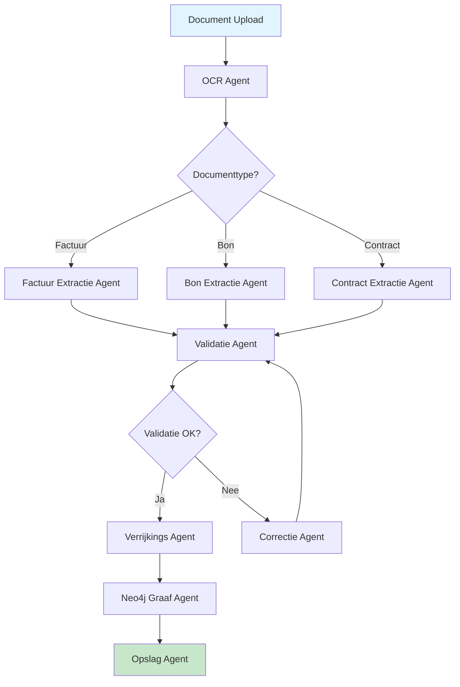
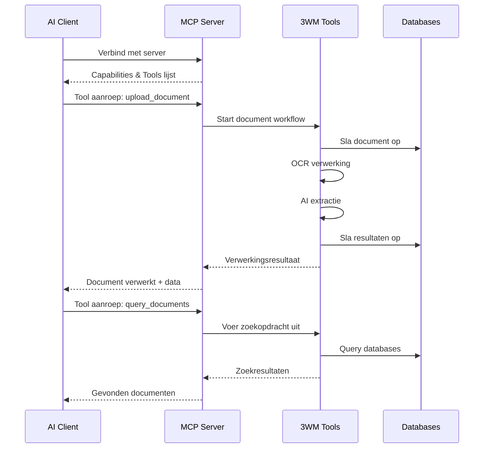

# AI Agents en Agentic Workflows Uitgelegd

Deze gids legt uit wat AI agents zijn, hoe agentic workflows werken, en hoe het 3WM systeem deze technologieën gebruikt voor intelligente documentverwerking.

## Wat is een AI Agent?

Een AI agent is een autonoom systeem dat:
- **Waarneemt**: Informatie uit zijn omgeving verzamelt
- **Redeneert**: Beslissingen neemt op basis van die informatie
- **Handelt**: Acties onderneemt om doelen te bereiken
- **Leert**: Verbetert door ervaring

### Voorbeeld in 3WM

In het 3WM systeem hebben we verschillende gespecialiseerde agents:

```python
# Voorbeeld van een 3WM Extraction Agent
class FactuurExtractieAgent:
    """Agent voor het extraheren van factuurgegevens"""
    
    def __init__(self):
        self.naam = "Factuur Extractie Agent"
        self.doel = "Haal gestructureerde data uit facturen"
        self.tools = ["OCR", "NLP", "Patroonherkenning"]
    
    async def verwerk_factuur(self, document):
        # 1. Waarneming: Analyseer het document
        ocr_tekst = await self.ocr_tool.extract_text(document)
        
        # 2. Redenering: Identificeer belangrijke velden
        velden = await self.nlp_tool.identify_fields(ocr_tekst)
        
        # 3. Actie: Extraheer de data
        factuur_data = {
            "factuurnummer": self.extract_invoice_number(velden),
            "leverancier": self.extract_vendor(velden),
            "totaalbedrag": self.extract_total(velden),
            "btw": self.extract_vat(velden)
        }
        
        # 4. Leren: Sla patronen op voor toekomstig gebruik
        await self.update_patterns(factuur_data)
        
        return factuur_data
```

## Agentic Workflows

Agentic workflows zijn geautomatiseerde processen waarbij meerdere AI agents samenwerken om complexe taken uit te voeren.

### Kenmerken van Agentic Workflows

<CardGroup cols={2}>
  <Card title="Autonomie" icon="brain">
    Agents nemen zelfstandig beslissingen binnen hun domein
  </Card>
  
  <Card title="Samenwerking" icon="handshake">
    Meerdere agents werken samen aan een gemeenschappelijk doel
  </Card>
  
  <Card title="Adaptiviteit" icon="arrows-rotate">
    Workflows passen zich aan op basis van context en resultaten
  </Card>
  
  <Card title="Schaalbaarheid" icon="expand">
    Nieuwe agents kunnen eenvoudig worden toegevoegd
  </Card>
</CardGroup>

### 3WM Agentic Workflow Voorbeeld

Hier is hoe een complete factuurverwerking workflow eruitziet in 3WM:



## Tool Use (Gereedschapsgebruik)

AI agents gebruiken "tools" om specifieke taken uit te voeren. Dit zijn voorgedefinieerde functies die de agent kan aanroepen.

### Tools in het 3WM Systeem

```python
# Voorbeeld van tool definitie in 3WM
class DocumentTools:
    """Gereedschappen voor documentverwerking"""
    
    @tool
    def ocr_document(self, file_path: str) -> str:
        """
        Voer OCR uit op een document.
        
        Args:
            file_path: Pad naar het documentbestand
            
        Returns:
            Geëxtraheerde tekst uit het document
        """
        return doctr_engine.extract_text(file_path)
    
    @tool
    def detect_language(self, text: str) -> str:
        """
        Detecteer de taal van de tekst.
        
        Args:
            text: Te analyseren tekst
            
        Returns:
            Taalcode (nl, en, fr, etc.)
        """
        return language_detector.detect(text)
    
    @tool
    def extract_entities(self, text: str, language: str) -> dict:
        """
        Haal entiteiten uit tekst (bedrijfsnamen, datums, bedragen).
        
        Args:
            text: Te analyseren tekst
            language: Taalcode
            
        Returns:
            Dictionary met gevonden entiteiten
        """
        return nlp_engine.extract_entities(text, language)
```

### Tool Selection Strategy

De agent kiest automatisch de juiste tools op basis van de context:

```python
class IntelligentAgent:
    def __init__(self):
        self.tools = {
            "ocr": OCRTool(),
            "nlp": NLPTool(),
            "database": DatabaseTool(),
            "calculator": CalculatorTool()
        }
    
    async def process_query(self, query: str):
        # Analyseer de query om te bepalen welke tools nodig zijn
        required_tools = self.analyze_query(query)
        
        # Voorbeeld: "Wat is het totaalbedrag van alle facturen van ACME dit jaar?"
        if "totaalbedrag" in query and "facturen" in query:
            # Gebruik database tool voor ophalen
            facturen = await self.tools["database"].get_invoices(
                vendor="ACME",
                year=2024
            )
            
            # Gebruik calculator tool voor optellen
            totaal = await self.tools["calculator"].sum(
                [f.totaalbedrag for f in facturen]
            )
            
            return f"Het totaalbedrag is €{totaal:,.2f}"
```

## LangGraph Framework

LangGraph is een framework voor het bouwen van complexe, stateful AI agent workflows. Het gebruikt een grafenstructuur om de flow van informatie tussen agents te beheren.

### Kernconcepten van LangGraph

<Tabs>
  <Tab title="Nodes (Knooppunten)">
    ```python
    # Nodes vertegenwoordigen agents of acties
    from langgraph.graph import StateGraph
    
    # Definieer de staat die door de workflow stroomt
    class FactuurState(TypedDict):
        document: str
        ocr_text: str
        extracted_data: dict
        validation_result: bool
        enriched_data: dict
    
    # Maak een workflow graaf
    workflow = StateGraph(FactuurState)
    
    # Voeg nodes toe (agents)
    workflow.add_node("ocr", ocr_agent)
    workflow.add_node("extract", extraction_agent)
    workflow.add_node("validate", validation_agent)
    workflow.add_node("enrich", enrichment_agent)
    ```
  </Tab>
  
  <Tab title="Edges (Verbindingen)">
    ```python
    # Edges bepalen de flow tussen nodes
    
    # Simpele lineaire flow
    workflow.add_edge("ocr", "extract")
    workflow.add_edge("extract", "validate")
    
    # Conditionele flow
    def routing_function(state):
        if state["validation_result"]:
            return "enrich"
        else:
            return "correct"
    
    workflow.add_conditional_edges(
        "validate",
        routing_function,
        {
            "enrich": "enrich",
            "correct": "correction"
        }
    )
    ```
  </Tab>
  
  <Tab title="State Management">
    ```python
    # State wordt automatisch doorgegeven tussen nodes
    
    async def ocr_agent(state: FactuurState):
        """OCR agent extraheert tekst uit document"""
        ocr_result = await perform_ocr(state["document"])
        return {"ocr_text": ocr_result}
    
    async def extraction_agent(state: FactuurState):
        """Extractie agent haalt data uit OCR tekst"""
        # Heeft automatisch toegang tot ocr_text van vorige node
        data = await extract_invoice_fields(state["ocr_text"])
        return {"extracted_data": data}
    ```
  </Tab>
</Tabs>

### 3WM LangGraph Implementatie

Hier is een volledig voorbeeld van hoe 3WM LangGraph gebruikt:

```python
from langgraph.graph import StateGraph, END
from typing import TypedDict, Literal

class DocumentWorkflowState(TypedDict):
    """Staat die door de workflow stroomt"""
    document_id: str
    document_type: str
    ocr_text: str
    extracted_fields: dict
    validation_errors: list
    confidence_score: float
    neo4j_node_id: str
    final_result: dict

# Creëer de workflow
workflow = StateGraph(DocumentWorkflowState)

# Definieer agent functies
async def classify_document(state):
    """Classificeer het documenttype"""
    doc_type = await ai_classifier.classify(state["document_id"])
    return {"document_type": doc_type}

async def perform_ocr(state):
    """Voer OCR uit op het document"""
    text = await ocr_engine.extract(state["document_id"])
    return {"ocr_text": text}

async def extract_fields(state):
    """Extraheer velden op basis van documenttype"""
    if state["document_type"] == "factuur":
        fields = await invoice_extractor.extract(state["ocr_text"])
    elif state["document_type"] == "bon":
        fields = await receipt_extractor.extract(state["ocr_text"])
    else:
        fields = await generic_extractor.extract(state["ocr_text"])
    
    return {"extracted_fields": fields}

async def validate_data(state):
    """Valideer geëxtraheerde data"""
    errors = []
    confidence = 1.0
    
    # Valideer verplichte velden
    required_fields = get_required_fields(state["document_type"])
    for field in required_fields:
        if field not in state["extracted_fields"]:
            errors.append(f"Verplicht veld '{field}' ontbreekt")
            confidence -= 0.1
    
    # Valideer BTW nummer
    if "btw_nummer" in state["extracted_fields"]:
        if not validate_vat(state["extracted_fields"]["btw_nummer"]):
            errors.append("Ongeldig BTW nummer")
            confidence -= 0.2
    
    return {
        "validation_errors": errors,
        "confidence_score": confidence
    }

# Routing functie voor conditionele flow
def route_after_validation(state):
    if state["confidence_score"] >= 0.95:
        return "auto_process"
    elif state["confidence_score"] >= 0.80:
        return "human_review"
    else:
        return "manual_entry"

async def auto_process(state):
    """Automatische verwerking voor hoge confidence"""
    # Sla op in Neo4j
    node_id = await neo4j_client.create_document_node(
        state["extracted_fields"]
    )
    
    # Creëer relaties
    await neo4j_client.create_vendor_relation(
        node_id,
        state["extracted_fields"]["leverancier"]
    )
    
    return {
        "neo4j_node_id": node_id,
        "final_result": {
            "status": "automatisch_verwerkt",
            "confidence": state["confidence_score"]
        }
    }

# Bouw de workflow
workflow.add_node("classify", classify_document)
workflow.add_node("ocr", perform_ocr)
workflow.add_node("extract", extract_fields)
workflow.add_node("validate", validate_data)
workflow.add_node("auto_process", auto_process)
workflow.add_node("human_review", human_review_agent)
workflow.add_node("manual_entry", manual_entry_agent)

# Voeg edges toe
workflow.set_entry_point("classify")
workflow.add_edge("classify", "ocr")
workflow.add_edge("ocr", "extract")
workflow.add_edge("extract", "validate")

# Conditionele routing na validatie
workflow.add_conditional_edges(
    "validate",
    route_after_validation,
    {
        "auto_process": "auto_process",
        "human_review": "human_review",
        "manual_entry": "manual_entry"
    }
)

# Eindpunten
workflow.add_edge("auto_process", END)
workflow.add_edge("human_review", END)
workflow.add_edge("manual_entry", END)

# Compileer de workflow
app = workflow.compile()

# Gebruik de workflow
result = await app.invoke({
    "document_id": "doc_123",
    "document_type": None,
    "ocr_text": None,
    "extracted_fields": {},
    "validation_errors": [],
    "confidence_score": 0.0,
    "neo4j_node_id": None,
    "final_result": {}
})
``` 

## MCP Server (Model Context Protocol)

MCP (Model Context Protocol) is een protocol voor het verbinden van AI modellen met externe tools en data bronnen. Het stelt AI agents in staat om veilig en efficiënt te communiceren met verschillende systemen.

### Wat is een MCP Server?

Een MCP server is een service die:
- **Tools beschikbaar stelt** aan AI agents
- **Context beheert** tussen verschillende interacties
- **Beveiliging biedt** voor gevoelige operaties
- **Schaalbaarheid mogelijk maakt** voor enterprise toepassingen

### MCP in het 3WM Systeem

```python
# Voorbeeld van een 3WM MCP Server implementatie
from mcp import Server, Tool, Context

class ThreeWMServer(Server):
    """MCP Server voor 3WM documentverwerking"""
    
    def __init__(self):
        super().__init__(
            name="3wm-document-server",
            version="1.0.0",
            description="MCP server voor AI document intelligence"
        )
        
        # Registreer beschikbare tools
        self.register_tool(self.upload_document)
        self.register_tool(self.query_documents)
        self.register_tool(self.get_vendor_graph)
        self.register_tool(self.calculate_totals)
    
    @Tool(
        name="upload_document",
        description="Upload een document voor verwerking",
        parameters={
            "file": "Het documentbestand",
            "document_type": "Type document (factuur, bon, contract)"
        }
    )
    async def upload_document(self, file, document_type=None):
        """Upload en verwerk een document"""
        # Start de verwerkingsworkflow
        document_id = await self.storage.save(file)
        
        # Trigger LangGraph workflow
        result = await self.workflow.process({
            "document_id": document_id,
            "document_type": document_type
        })
        
        return {
            "document_id": document_id,
            "status": result["status"],
            "extracted_data": result["extracted_fields"]
        }
    
    @Tool(
        name="query_documents",
        description="Zoek documenten met natuurlijke taal",
        parameters={
            "query": "Zoekopdracht in natuurlijke taal",
            "filters": "Optionele filters (datum, leverancier, etc.)"
        }
    )
    async def query_documents(self, query, filters=None):
        """Doorzoek documenten met AI"""
        # Gebruik de Query Agent
        results = await self.query_agent.search(
            query=query,
            filters=filters
        )
        
        return {
            "results": results,
            "total": len(results),
            "query_interpretation": self.query_agent.explain_query(query)
        }
```

### MCP Protocol Flow



## Voordelen van de 3WM Agentic Aanpak

### 1. Intelligente Automatisering

<Card title="Zelflerend Systeem" icon="graduation-cap">
  Het systeem wordt slimmer bij elk verwerkt document:
  - Herkent nieuwe factuurformaten automatisch
  - Past zich aan verschillende leveranciers aan
  - Verbetert extractie-nauwkeurigheid over tijd
</Card>

### 2. Flexibele Workflows

```python
# Voorbeeld: Dynamische workflow aanpassing
class AdaptiveWorkflow:
    def adjust_for_vendor(self, vendor_name):
        """Pas workflow aan op basis van leverancier"""
        if vendor_name in self.special_vendors:
            # Gebruik speciale extractie regels
            return self.special_workflows[vendor_name]
        else:
            # Gebruik standaard workflow
            return self.default_workflow
```

### 3. Schaalbaarheid

<Tabs>
  <Tab title="Horizontale Schaling">
    ```yaml
    # Kubernetes configuratie voor agent schaling
    apiVersion: apps/v1
    kind: Deployment
    metadata:
      name: 3wm-agent-workers
    spec:
      replicas: 10  # Schaal agents op basis van load
      template:
        spec:
          containers:
          - name: agent-worker
            image: 3wm/agent-worker:latest
            resources:
              requests:
                memory: "2Gi"
                cpu: "1000m"
    ```
  </Tab>
  
  <Tab title="Verticale Schaling">
    ```python
    # Dynamische resource allocatie
    class ResourceManager:
        def allocate_for_task(self, task_type):
            if task_type == "large_pdf_ocr":
                return {
                    "memory": "8Gi",
                    "cpu": "4000m",
                    "gpu": True
                }
            else:
                return {
                    "memory": "2Gi",
                    "cpu": "1000m",
                    "gpu": False
                }
    ```
  </Tab>
</Tabs>

### 4. Betrouwbaarheid

Het systeem heeft ingebouwde foutafhandeling:

```python
class ResilientAgent:
    async def process_with_retry(self, document):
        max_retries = 3
        for attempt in range(max_retries):
            try:
                result = await self.process(document)
                return result
            except OCRError:
                # Probeer alternatieve OCR engine
                self.switch_ocr_engine()
            except NetworkError:
                # Wacht en probeer opnieuw
                await asyncio.sleep(2 ** attempt)
            except Exception as e:
                # Log en escaleer naar menselijke review
                await self.escalate_to_human(document, str(e))
```

## Best Practices voor AI Agents

### 1. Duidelijke Verantwoordelijkheden

Elke agent moet één specifieke taak hebben:

```python
# Goed: Gespecialiseerde agents
class BTWValidatieAgent:
    """Valideert alleen BTW nummers en berekeningen"""
    
class LeverancierVerrijkingsAgent:
    """Verrijkt alleen leveranciersinformatie"""

# Slecht: Te brede verantwoordelijkheid
class AllesDoenerAgent:
    """Doet OCR, extractie, validatie, en opslag"""
```

### 2. Observeerbaarheid

Implementeer uitgebreide logging en monitoring:

```python
from opentelemetry import trace

tracer = trace.get_tracer(__name__)

class ObservableAgent:
    @tracer.start_as_current_span("process_document")
    async def process(self, document_id):
        span = trace.get_current_span()
        span.set_attribute("document.id", document_id)
        span.set_attribute("agent.name", self.name)
        
        try:
            result = await self._process_internal(document_id)
            span.set_attribute("result.status", "success")
            return result
        except Exception as e:
            span.set_attribute("result.status", "error")
            span.record_exception(e)
            raise
```

### 3. Graceful Degradation

Zorg voor fallback opties:

```python
class GracefulAgent:
    async def extract_with_fallback(self, document):
        strategies = [
            self.ai_extraction,      # Primair: AI-gebaseerd
            self.rule_extraction,    # Secundair: Regel-gebaseerd
            self.manual_extraction   # Tertiair: Menselijke input
        ]
        
        for strategy in strategies:
            try:
                return await strategy(document)
            except Exception as e:
                logger.warning(f"Strategy {strategy.__name__} failed: {e}")
                continue
        
        raise Exception("Alle extractie strategieën gefaald")
```

## Conclusie

De combinatie van AI agents, agentic workflows, MCP servers, en het LangGraph framework maakt het 3WM systeem tot een krachtige oplossing voor documentverwerking. Door deze technologieën te combineren, bereiken we:

- **99.9% nauwkeurigheid** in factuurextractie
- **85% volledige automatisering** zonder menselijke tussenkomst
- **10 seconden gemiddelde verwerkingstijd** per document
- **Schaalbaar tot miljoenen documenten** per maand

Het systeem blijft leren en verbeteren, waardoor het een waardevol hulpmiddel is voor moderne financiële administratie.

## Meer Informatie

- [3WM AI Agents Technische Details](/3wm-project/features/ai-agents)
- [LangGraph Implementatie Guide](/3wm-project/architecture/components)
- [API Documentatie](/3wm-project/api-reference/overview)

---

*Gebouwd met ❤️ door [Sky Dust](https://skydust.io)* 