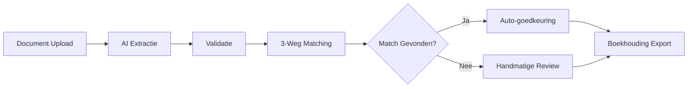

# 3WM Systeemoverzicht

3WM (3-Weg Matching) is een AI-gestuurd documentverwerkingssysteem dat factuurverwerking automatiseert met behulp van geavanceerde machine learning en intelligente workflow-orchestratie.

## Wat is 3WM?

3WM is een enterprise-grade oplossing die:

<CardGroup cols={2}>
  <Card title="Documenten Automatiseert" icon="file-invoice">
    Verwerkt facturen, inkooporders en ontvangstbewijzen automatisch
  </Card>
  <Card title="AI-gestuurde Extractie" icon="brain">
    Gebruikt state-of-the-art AI voor nauwkeurige gegevensextractie
  </Card>
  <Card title="Intelligente Matching" icon="link">
    Voert automatische 3-weg matching uit voor verificatie
  </Card>
  <Card title="Naadloze Integratie" icon="plug">
    Integreert met bestaande systemen via moderne APIs
  </Card>
</CardGroup>

## Kernfunctionaliteiten

### 1. Documentverwerking
- **Multi-formaat ondersteuning**: PDF, afbeeldingen, gescande documenten
- **AI-extractie**: Automatische herkenning van factuurvelden
- **OCR-fallback**: Voor gescande of afbeeldingsgebaseerde documenten
- **Validatie**: Automatische controle van geëxtraheerde gegevens

### 2. 3-Weg Matching
- **Automatische matching**: Koppel facturen aan PO's en ontvangstbewijzen
- **Fuzzy matching**: Intelligente matching ook bij kleine verschillen
- **Discrepantie-detectie**: Identificeer en rapporteer afwijkingen
- **Goedkeuringsworkflows**: Configureerbare goedkeuringsprocessen

### 3. AI Agents
- **Extractie Agent**: Haalt gegevens uit documenten
- **Validatie Agent**: Controleert gegevensintegriteit
- **Matching Agent**: Voert 3-weg matching uit
- **Beslissings Agent**: Bepaalt vervolgacties

### 4. Integraties
- **E-mail**: Microsoft Outlook integratie
- **Boekhouding**: AccountView export
- **API**: RESTful API voor custom integraties
- **Webhooks**: Real-time gebeurtenisnotificaties

## Technische Architectuur

<Tabs>
  <Tab title="Backend Stack">
    ```python
    # Core technologieën
    - Python 3.13+ met uv package manager
    - FastAPI voor high-performance APIs
    - LangGraph 0.3.21+ voor workflow orchestratie
    - LangChain 0.3.22+ voor AI-integratie
    - Supabase voor database en authenticatie
    - Redis voor caching en queues
    ```
  </Tab>
  
  <Tab title="Frontend Stack">
    ```typescript
    // Moderne web technologieën
    - Next.js 14 met App Router
    - TypeScript voor type-safety
    - CopilotKit voor AI-assistentie
    - Radix UI voor toegankelijke componenten
    - Tailwind CSS voor styling
    - Bun als package manager
    ```
  </Tab>
  
  <Tab title="AI/ML Stack">
    ```yaml
    # AI en Machine Learning
    - OpenAI GPT-4 voor natuurlijke taalverwerking
    - Claude 3 voor documentanalyse
    - Custom ML-modellen voor factuurherkenning
    - Tesseract OCR voor tekstextractie
    - LangGraph voor agent-orchestratie
    ```
  </Tab>
</Tabs>

## Systeemvereisten

<AccordionGroup>
  <Accordion title="Hardware Vereisten">
    - **CPU**: 4+ cores (8+ aanbevolen voor productie)
    - **RAM**: 8GB minimum (16GB+ aanbevolen)
    - **Opslag**: 50GB+ voor documenten en database
    - **Netwerk**: Stabiele internetverbinding voor cloud services
  </Accordion>
  
  <Accordion title="Software Vereisten">
    - **OS**: Linux (Ubuntu 20.04+), macOS, of Windows met WSL2
    - **Python**: 3.13 of hoger
    - **Node.js**: 18.x of hoger (voor frontend)
    - **Docker**: 20.x+ (optioneel maar aanbevolen)
    - **Supabase**: Account voor database en authenticatie
  </Accordion>
  
  <Accordion title="Cloud Services">
    - **Supabase**: PostgreSQL database, authenticatie, en opslag
    - **OpenAI/Anthropic**: API toegang voor AI-modellen
    - **Microsoft Azure**: Voor Outlook integratie
    - **Redis Cloud**: Voor gedistribueerde caching (optioneel)
  </Accordion>
</AccordionGroup>

## Workflow Overzicht



## Belangrijkste Voordelen

<CardGroup cols={3}>
  <Card title="Tijdsbesparing" icon="clock">
    Verminder verwerkingstijd met 80% door automatisering
  </Card>
  <Card title="Nauwkeurigheid" icon="bullseye">
    99%+ extractienauwkeurigheid met AI-modellen
  </Card>
  <Card title="Schaalbaarheid" icon="chart-line">
    Verwerk duizenden documenten per dag
  </Card>
  <Card title="Compliance" icon="shield-check">
    Voldoet aan Nederlandse wetgeving en GDPR
  </Card>
  <Card title="Integratie" icon="puzzle">
    Naadloze koppeling met bestaande systemen
  </Card>
  <Card title="ROI" icon="coins">
    Gemiddeld 6 maanden terugverdientijd
  </Card>
</CardGroup>

## Use Cases

### Factuurverwerking
- Automatische extractie van leverancier, bedrag, datum
- Validatie tegen inkooporders
- Goedkeuringsrouting op basis van bedrag

### Ontvangstverificatie
- Match facturen met leveringen
- Identificeer kwantiteitsverschillen
- Voorkom dubbele betalingen

### Compliance & Audit
- Volledige audit trail
- Automatische archivering
- Rapportage voor controles

## Volgende Stappen

<Steps>
  <Step title="Installatie">
    Volg onze [installatie handleiding](/docs/3wm-project/getting-started/installation) om 3WM op te zetten
  </Step>
  <Step title="Configuratie">
    Configureer het systeem volgens uw [bedrijfsprocessen](/docs/3wm-project/getting-started/configuration)
  </Step>
  <Step title="Integratie">
    Koppel 3WM met uw [bestaande systemen](/docs/3wm-project/api-reference/overview)
  </Step>
  <Step title="Training">
    Train uw team met onze [best practices](/docs/3wm-project/guides/best-practices)
  </Step>
</Steps>

## Support & Resources

- **Documentatie**: U bent hier! Verken alle mogelijkheden
- **API Referentie**: [Technische API documentatie](/docs/3wm-project/api-reference/overview)
- **Community**: [Slack kanaal](https://skydust.ai/slack) voor vragen
- **Support**: support@skydust.ai voor enterprise ondersteuning 