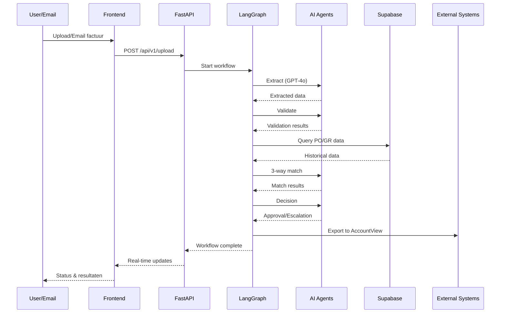

# 3WM Systeemoverzicht

3WM is een enterprise-grade AI-powered factuurautomatiseringssysteem gebouwd op moderne cloud-native technologieën. Het systeem gebruikt state-of-the-art AI modellen en intelligente workflow orchestratie voor end-to-end factuurverwerking.

## Core Architectuur

### LangGraph Orchestratie

Het hart van 3WM is gebouwd op **LangGraph 0.3.21+**, wat complexe multi-agent workflows mogelijk maakt:

```python
# Voorbeeld van onze agent graph implementatie
from langgraph.graph import StateGraph, END
from app.agents import ExtractionAgent, ValidationAgent, MatchingAgent, DecisionAgent

# Agent orchestratie met conditionele routing
builder = StateGraph(InvoiceState)
builder.add_node("extraction", ExtractionAgent())
builder.add_node("validation", ValidationAgent())
builder.add_node("matching", MatchingAgent())
builder.add_node("decision", DecisionAgent())

# Intelligente routing gebaseerd op confidence scores
builder.add_conditional_edges(
    "extraction",
    lambda x: "validation" if x.confidence > 0.8 else "manual_review"
)
```

### AI Agent Architectuur

<CardGroup cols={2}>
  <Card title="Extraction Agent" icon="file-invoice">
    **Multi-method extraction** met GPT-4o Vision als primaire engine:
    - GPT-4 Vision voor complexe layouts
    - DocTR OCR als fallback
    - LlamaCloud voor gestructureerde data
    - Zelf-validatie van resultaten
  </Card>
  
  <Card title="Validation Agent" icon="shield-check">
    **Comprehensive validation** van geëxtraheerde data:
    - VAT nummer verificatie
    - IBAN validatie via algoritmes
    - Datumlogica controles
    - Business rule compliance
  </Card>
  
  <Card title="Matching Agent" icon="link">
    **3-Way matching engine** met fuzzy logic:
    - Invoice ↔ PO matching
    - PO ↔ Goods Receipt matching
    - Tolerantie-gebaseerde matching
    - Line-item reconciliation
  </Card>
  
  <Card title="Decision Agent" icon="brain">
    **Autonome besluitvorming** voor workflow routing:
    - Automatische goedkeuring binnen toleranties
    - Escalatie naar juiste approvers
    - Fraud detectie signalen
    - Leer van historische beslissingen
  </Card>
</CardGroup>

## Technische Stack

### Backend Infrastructure

```yaml
# Productie stack overzicht
services:
  api:
    framework: FastAPI
    python: "3.13+"
    async: true
    workers: uvicorn[standard]
    
  ai_stack:
    orchestration: LangGraph 0.3.21+
    llm_primary: OpenAI GPT-4o
    llm_secondary: Anthropic Claude 3
    embeddings: OpenAI text-embedding-3
    observability: Langfuse 2.60+
    
  data_layer:
    primary_db: Supabase (PostgreSQL)
    cache: Redis
    file_storage: Supabase Storage
    vector_db: pgvector
    
  integration:
    email: Microsoft Graph API
    accounting: AccountView Export API
    mcp: Model Context Protocol 1.9+
    copilot: CopilotKit 1.9.3+
```

### Frontend Architecture

Het frontend is gebouwd met moderne React technologieën:

- **Next.js 15.2.4** met App Router voor optimale performance
- **TypeScript 5.8+** voor type safety
- **CopilotKit** voor real-time AI assistentie
- **Radix UI** voor toegankelijke componenten
- **Bun** als snelle package manager

## Data Flow



## Security & Compliance

### Authenticatie & Autorisatie

- **JWT-based authentication** via Supabase Auth
- **Role-based access control** (RBAC)
- **Session management** met refresh tokens
- **API key authentication** voor service accounts

### Data Security

<Steps>
  <Step title="Encryptie">
    - TLS 1.3 voor alle API communicatie
    - AES-256 encryptie at rest in Supabase
    - Encrypted file uploads met pre-signed URLs
  </Step>
  
  <Step title="Compliance">
    - GDPR compliant data handling
    - Audit logging van alle acties
    - Data retention policies
    - Right to deletion support
  </Step>
  
  <Step title="Rate Limiting">
    - Slowapi voor API rate limiting
    - Configureerbare limits per endpoint
    - DDoS bescherming
  </Step>
</Steps>

## Monitoring & Observability

### LLM Observability met Langfuse

```python
# Automatische tracing van alle LLM calls
from langfuse import Langfuse

langfuse = Langfuse(
    public_key=settings.LANGFUSE_PUBLIC_KEY,
    secret_key=settings.LANGFUSE_SECRET_KEY
)

# Elke LLM call wordt automatisch getraceerd
# inclusief prompts, responses, latency, en kosten
```

### Metrics & Monitoring

- **Prometheus** metrics collection
- **Grafana** dashboards voor visualisatie
- **Structured logging** met contextual information
- **Error tracking** en alerting

## Performance & Schaling

### Optimalisaties

- **Async/await** throughout voor maximale throughput
- **Redis caching** voor frequent opgevraagde data
- **Connection pooling** voor database efficiency
- **Lazy loading** van AI modellen

### Schaalbaarheid

<Tabs>
  <Tab title="Horizontaal">
    - Kubernetes-ready deployment
    - Auto-scaling op basis van CPU/memory
    - Load balancing met health checks
    - Stateless API design
  </Tab>
  
  <Tab title="Verticaal">
    - GPU support voor on-premise OCR
    - Memory-optimized instances
    - Database read replicas
    - Caching layers
  </Tab>
</Tabs>

## Integraties

### Microsoft Outlook

```python
# Native Graph API integratie
from msgraph import GraphServiceClient

# Automatisch ophalen van facturen uit email
async def process_outlook_invoices():
    messages = await graph_client.me.messages.get()
    for message in messages.value:
        if has_invoice_attachment(message):
            await process_invoice(message.attachments)
```

### AccountView Export

- Direct API integratie voor factuur export
- Mapping van 3WM velden naar AccountView
- Automatische journaalpost suggesties
- Error handling en retry mechanismen

## Development Experience

### Local Development

```bash
# Quick start met Docker Compose
docker-compose up -d

# Of native development
uv sync
make dev

# Frontend development
cd client && bun dev
```

### Testing & Quality

- **Pytest** voor backend testing
- **Jest** voor frontend testing
- **Ruff** voor code formatting
- **Type checking** met mypy
- **Pre-commit hooks** voor kwaliteit

## Toekomstige Ontwikkelingen

<CardGroup cols={2}>
  <Card title="Neo4j Integration" icon="diagram-project">
    Knowledge graph voor vendor relationships en patterns
  </Card>
  
  <Card title="Advanced Analytics" icon="chart-line">
    Predictive analytics voor spend optimization
  </Card>
  
  <Card title="Multi-language Support" icon="language">
    Uitbreiding naar meer talen dan Nederlands/Engels
  </Card>
  
  <Card title="Mobile App" icon="mobile">
    Native mobile apps voor approval workflows
  </Card>
</CardGroup> 