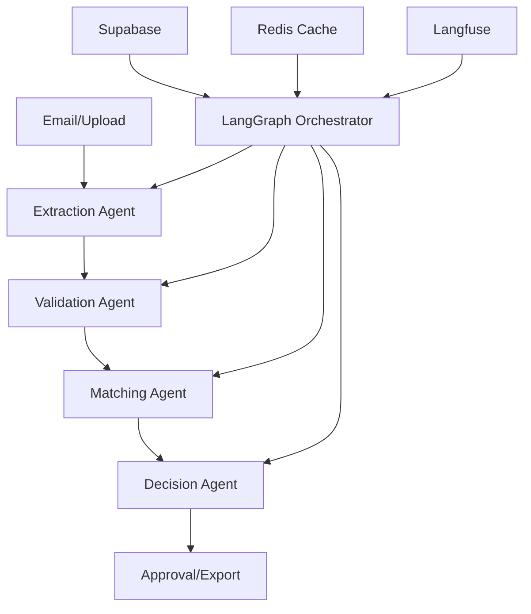

import { HeroPattern } from '@/components/HeroPattern'

<HeroPattern />

# 3WM AI Document Intelligence

Welkom bij de officiële documentatie voor 3WM, een geavanceerd AI-aangedreven document intelligence systeem ontwikkeld door Sky Dust Intelligence voor enterprise factuurautomatisering.

## 3WM AI Document Intelligence

3WM is een state-of-the-art factuurverwerkingssysteem dat gebruik maakt van:

- **LangGraph 0.3.21+** voor complexe workflow orchestratie
- **GPT-4o en Claude 3** voor intelligente documentverwerking
- **Model Context Protocol (MCP)** voor tool integratie
- **CopilotKit 1.9.3+** voor real-time UI updates
- **Supabase** voor schaalbare data opslag
- **Langfuse** voor LLM observability

<CardGroup cols={2}>
  <Card title="Aan de slag" icon="rocket" href="/docs/3wm-project/getting-started/quickstart">
    Start met 3WM in 5 minuten met Docker Compose
  </Card>
  <Card title="Core Features" icon="sparkles" href="/docs/3wm-project/features/ai-agents">
    Ontdek onze LangGraph-gebaseerde AI agents
  </Card>
  <Card title="API Referentie" icon="code" href="/docs/3wm-project/api-reference/overview">
    Integreer met onze FastAPI endpoints
  </Card>
  <Card title="Deployment" icon="server" href="/docs/3wm-project/deployment/docker">
    Deploy naar productie met Kubernetes
  </Card>
</CardGroup>

## Waarom 3WM?

<CardGroup cols={3}>
  <Card title="99.5% Nauwkeurigheid" icon="bullseye">
    GPT-4o vision + OCR fallback voor betrouwbare extractie
  </Card>
  <Card title="3-Way Matching" icon="check-double">
    Automatische matching van factuur ↔ PO ↔ ontvangst
  </Card>
  <Card title="Real-time Updates" icon="bolt">
    CopilotKit integratie voor instant UI feedback
  </Card>
</CardGroup>

## Tech Stack

<Tabs>
  <Tab title="Backend">
    - **Framework**: FastAPI met async support
    - **AI Orchestratie**: LangGraph 0.3.21+
    - **LLM Providers**: OpenAI GPT-4o, Anthropic Claude 3
    - **Database**: Supabase (PostgreSQL)
    - **Caching**: Redis
    - **Monitoring**: Langfuse, Prometheus, Grafana
  </Tab>
  <Tab title="Frontend">
    - **Framework**: Next.js 15.2.4 met App Router
    - **UI Library**: Radix UI + Tailwind CSS
    - **AI Integration**: CopilotKit 1.9.3+
    - **Package Manager**: Bun
    - **Type Safety**: TypeScript 5.8+
    - **PDF Viewing**: react-pdf 9.2.1
  </Tab>
  <Tab title="Infrastructure">
    - **Containerization**: Docker + Docker Compose
    - **Orchestration**: Kubernetes ready
    - **Email**: Microsoft Graph API
    - **Authentication**: JWT + Supabase Auth
    - **Rate Limiting**: slowapi
    - **Logging**: structlog
  </Tab>
</Tabs>

## Kernfunctionaliteiten

### 🤖 AI-Powered Extraction
- **Multi-method approach**: GPT-4 Vision, DocTR OCR, LlamaCloud
- **Zelf-validatie**: Automatische verificatie van geëxtraheerde data
- **Confidence scoring**: Betrouwbaarheidsniveaus per veld

### 🔄 3-Way Matching Engine
- **Fuzzy matching**: Intelligente toleranties voor variaties
- **Line-item reconciliation**: Gedetailleerde regel-voor-regel matching
- **Variance handling**: Automatische afhandeling binnen drempels

### 📧 Email Integration
- **Microsoft Outlook**: Native Graph API integratie
- **Auto-processing**: Automatische verwerking van factuur bijlagen
- **Smart routing**: Intelligente doorsturen naar juiste approvers

### 🔍 Validation & Compliance
- **VAT validation**: Automatische BTW-nummer verificatie
- **IBAN checks**: Bankrekening validatie
- **Business rules**: Configureerbare compliance regels

## Architectuur Overzicht

## Quick Links

<CardGroup cols={2}>
  <Card title="Installation Guide" icon="download" href="/docs/3wm-project/getting-started/installation">
    Gedetailleerde installatie instructies voor verschillende omgevingen
  </Card>
  <Card title="Architecture Deep Dive" icon="sitemap" href="/docs/3wm-project/architecture/overview">
    Technische architectuur en design beslissingen
  </Card>
  <Card title="Best Practices" icon="lightbulb" href="/docs/3wm-project/guides/best-practices">
    Productie-ready configuratie en optimalisaties
  </Card>
  <Card title="Troubleshooting" icon="wrench" href="/docs/3wm-project/guides/troubleshooting">
    Oplossingen voor veelvoorkomende problemen
  </Card>
</CardGroup>

## Support

Voor vragen of ondersteuning:
- 📧 Email: support@skydust.ai
- 💬 Slack: [Sky Dust Community](https://skydust.ai/slack)
- 🐛 Issues: [GitHub Issues](https://github.com/sky-dust-intelligence/3wm/issues) 